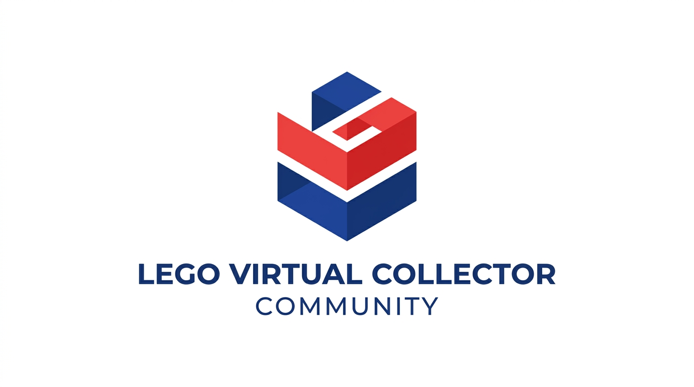
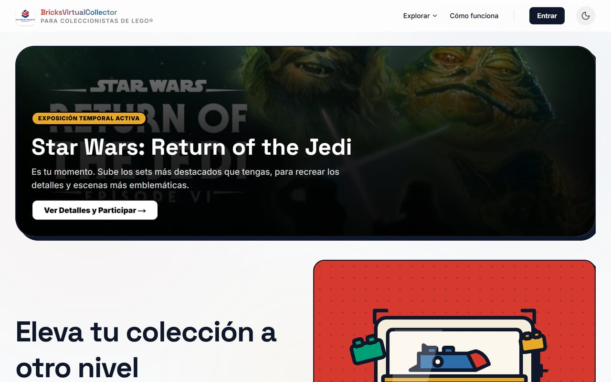
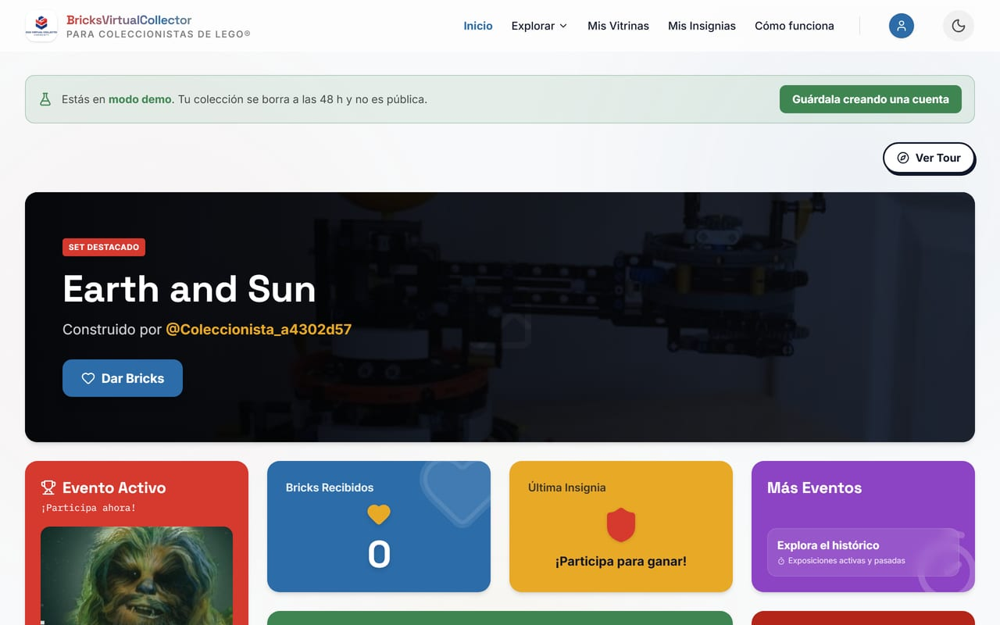
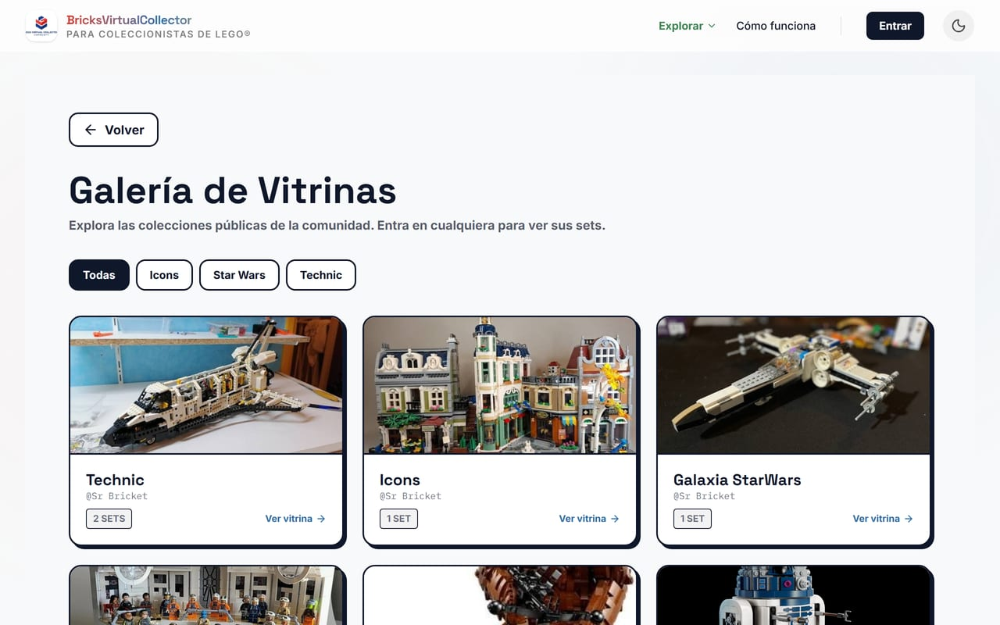
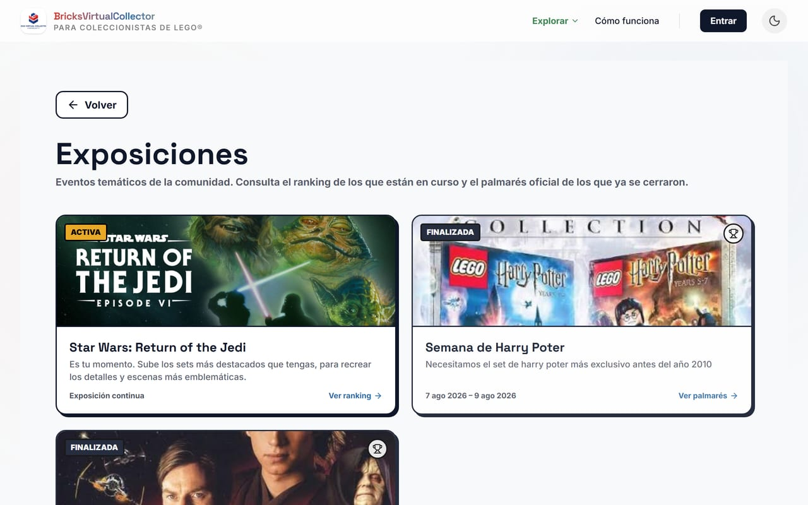
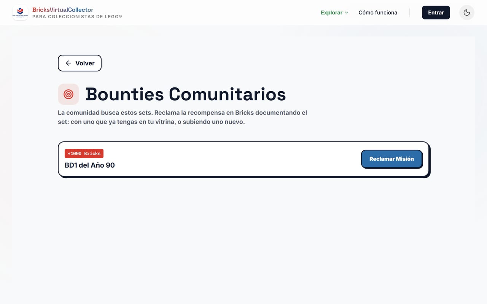
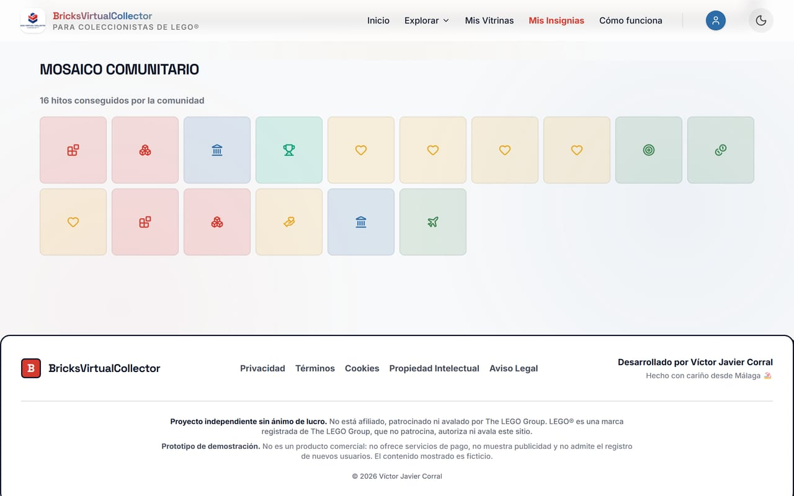

  

<h1 align="center">BricksVirtualCollector</h1>

<strong>El museo virtual para tu colección de LEGO®.</strong> Expón lo que construyes. Descubre lo que construyen otros. Sin exponerte a ti.

  <a href="https://bricks-virtual-collector.vercel.app"><strong>🔗 Probar la demo en vivo →</strong></a>

  
  
  

---

## El problema de todo AFOL

Terminas un MOC, le haces una foto orgulloso... ¿y ahora qué? Las redes generalistas te obligan
a elegir: o compartes con tu nombre y tu cara, con desconocidos escribiéndote y coordenadas GPS
de tu salón viajando dentro del EXIF de la foto, o guardas el modelo en una carpeta del móvil
donde nadie más que tú lo vuelve a ver.

**BricksVirtualCollector** parte de otra idea: un museo solo para tu colección, donde el
protagonista es lo que construyes, no quién eres.

## Cómo se vive por dentro

- 🏛️ **Tus propias vitrinas.** Organiza tus sets por temática, escribe sus fichas, decide qué se
  ve y qué no. Pública, privada, o solo con enlace para quien tú quieras.
- 🎭 **Anonimato real, no una casilla de ajustes.** Alias en vez de tu nombre. Sin mensajería
  directa entre usuarios. Y cada foto pasa por una limpieza de metadatos EXIF/GPS antes de
  guardarse — nadie averigua dónde vives por una estantería de fondo.
- 🧭 **Una galería que se explora.** Recorre las colecciones públicas de otros coleccionistas,
  filtra por temática (Star Wars, Technic, Icons...) y descubre construcciones que no habrías
  encontrado buscando por tu cuenta.
- 🏆 **Exposiciones temáticas y retos comunitarios.** Participa en la exposición activa del
  momento, sube el set que la comunidad está pidiendo y gana *Bricks* — la moneda de
  reconocimiento entre coleccionistas, no dinero real.
- 🎖️ **Progreso que se queda.** Insignias, un mosaico comunitario y un histórico de en qué
  exposiciones has dejado huella. Tu trayectoria como coleccionista, visible de un vistazo.
- ⚡ **Pruébalo antes de decidir nada.** Entra sin registrarte y recorre la aplicación entera —
  crea una vitrina, sube un set, vota, reclama un reto — en un sandbox propio que se borra solo a
  las 48 h. Ningún dato tuyo, ni siquiera un email.

  
  
  

Exposiciones temáticas · Bounties (retos con recompensa) · Mosaico comunitario de insignias

## Pruébalo tú mismo

👉 **[bricks-virtual-collector.vercel.app](https://bricks-virtual-collector.vercel.app)**

Sin registro, sin email, sin tarjeta. Un clic en "Probar sin registrarme" y estás dentro.

## Por qué existe

Este proyecto nace de una pregunta sencilla: ¿por qué la privacidad y el orgullo de coleccionista
tienen que ser incompatibles? Lo construí como pieza de portfolio para demostrar cómo pienso un
producto de principio a fin — desde la propuesta de valor hasta el detalle de que una foto de tu
estantería no debería delatar dónde vives — no solo cómo escribo código.

## Construido con

Next.js (App Router) · React · TypeScript · Tailwind CSS · Supabase (Postgres, Auth, Storage con
RLS) · Vitest & Playwright para testing · desplegado en Vercel.

---

**Proyecto independiente sin ánimo de lucro. No está afiliado, patrocinado ni avalado por The LEGO
Group.** LEGO® es una marca registrada de The LEGO Group, que no patrocina, autoriza ni avala este
sitio. Los diseños oficiales de sets, minifiguras y el formato del brick son propiedad intelectual
de The LEGO Group.

El código se distribuye bajo licencia [Apache 2.0](LICENSE).

  Desarrollado por <strong>Víctor Javier Corral</strong> desde Málaga · <a href="https://github.com/victorjaviercorral/BricksVirtualCollector/issues">Reportar un problema</a>

