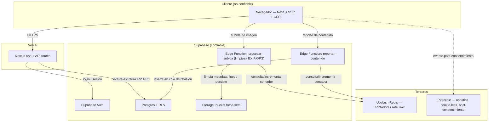

# Spec — Lego Virtual Museum

**Basada en:** PRD-lite v0.2 · **Etapa:** MVP · **Exposición:** X2
**Fecha:** 2026-07-27 · **Versión:** 0.2

> Secciones 1-5, 11 y 12: núcleo, siempre. Secciones 5b-10 activadas por exposición X2
> (`docs/modelo.md` §3.2): 5b privacidad, 6 accesibilidad, 7 performance, 8 test, 9 operación,
> 10 medición. Sección 13 (módulo de cumplimiento) no aplica: no hay señal de X3.

## 1. Contexto y arquitectura

**Stack elegido:** Next.js (React) + Tailwind CSS, desplegado en Vercel (ADR-001); Supabase
— Postgres + Auth + Storage, con Supabase Edge Functions para lógica de servidor (ADR-002);
Upstash Redis para rate limiting (ADR-003).

**Componentes y flujo de datos:**

**Límites de confianza:** el navegador es la única superficie no confiable. Toda imagen cruza
la Edge Function `procesar-subida` antes de tocar Storage — ahí se limpia EXIF/GPS (RC-01,
ADR-005); la imagen original con metadata nunca se persiste. Todo reporte cruza
`reportar-contenido` (rate limit vía Upstash, ADR-003) antes de insertarse en la cola de
revisión, legible solo por el rol `admin` (RLS). Supabase Auth es el límite de identidad:
ninguna contraseña ni token se gestiona a mano. Plausible se carga solo tras el consentimiento
explícito del usuario.

## 2. Trazabilidad

| Req ID | Requisito | Origen (PRD §/RC-XX/ADR) | Criterio de verificación | Tipo |
|--------|-----------|--------------------------|--------------------------|:---:|
| R-01 | Crear vitrina con catalogación básica de set: nombre obligatorio; fecha, código, nº piezas, temática opcionales. | PRD §6 C1 | Crear vitrina solo con nombre → persiste; sin nombre → 422. | test-auto |
| R-02 | Limpieza automática de metadatos EXIF/GPS de toda imagen subida antes de persistirla; la original con metadata nunca se almacena. | PRD RC-01; PRD §6 C2; ADR-005 | Subir imagen con GPS embebido, comprobar su ausencia en el archivo servido (caso de referencia constitution A.2). | test-auto |
| R-03 | Publicar vitrina con 3 niveles de visibilidad: pública, privada sin acceso, privada con enlace de invitación. | PRD §6 C3 | Cada nivel produce el comportamiento de acceso correspondiente. | test-auto |
| R-04 | Registro/login sin datos de contacto obligatorios ni foto de perfil personal; avatar genérico por defecto. | PRD RC-01; PRD §6 C4 | Crear cuenta con solo email+password, sin campos adicionales obligatorios. | test-auto |
| R-05 | Sin mensajería ni contacto directo 1:1 entre usuarios, en ningún flujo. | PRD RC-02 | Ausencia verificada de endpoints de mensajería; inspección de flujos (sección 11). | inspección + test-auto |
| R-06 | Reporte de contenido a cola de revisión solo-admin, sin exponer identidad del reportante al reportado ni correlacionar IP/sesión hacia el reportado. | PRD RC-03; ADR-004; PRD §6 C5 | El reportado nunca tiene acceso a la vista de reportes; rate limit 5/hora probado. | test-auto |
| R-07 | Vista resumen de perfil: nº de sets, temática predominante, datos agregados básicos. | PRD §6 C6 | Cálculo agregado correcto sobre datos de prueba. | test-auto |
| R-08 | Zona "Explorar": filtros por temática y coincidencia opcional con intereses guardados. | PRD §6 C7 (should) | Si se implementa en esta fase, test-auto; si se recorta, documentado en sección 12. | test-auto / diferido |
| R-09 | RC-04 (GDPR completo: borrado, minimización, base legal, consentimiento) cubierto íntegro en sección 5b (PRIV-01 a PRIV-20). | PRD RC-04 | Manual — checklist de sección 5b sin ítems `[PENDIENTE]` abiertos al cierre de `/plan`/preflight, más test-auto del subconjunto automatizable: borrado en cascada ejecutado (ver PRIV-09), ausencia de EXIF (cubierta por R-02), sin llamadas de red a Plausible antes del opt-in (PRIV-11). | manual + test-auto (subconjunto) |

Cobertura RC-XX: RC-01 → R-02, R-04 · RC-02 → R-05 · RC-03 → R-06 · RC-04 → R-09 (→ 5b). **100%.**

## 3. Modelo de datos

| Entidad | Campo | Tipo | Clasificación | Notas |
|---------|-------|------|:---:|-------|
| usuarios_perfil | id | uuid (FK auth.users) | personal | 1:1 con Supabase Auth |
| usuarios_perfil | avatar_generico | enum | público | sin foto de perfil real (RC-01) |
| usuarios_perfil | consentimiento_version | text | personal | `[PENDIENTE: confirmar esquema exacto en /plan]` |
| usuarios_perfil | consentimiento_fecha | timestamptz | personal | PRIV-06 |
| usuarios_perfil | creado_en | timestamptz | público | |
| usuarios_perfil | eliminado_en | timestamptz, nullable | personal | borrado lógico previo a purga física (R-09) |
| vitrinas | id | uuid | público | PK |
| vitrinas | usuario_id | uuid (FK) | personal | no expuesto en vistas públicas |
| vitrinas | titulo | text | público | |
| vitrinas | visibilidad | enum (publica\|privada\|privada_enlace) | público | |
| vitrinas | token_invitacion | text, nullable | personal | solo si visibilidad=privada_enlace, funciona como secreto |
| vitrinas | estado | enum (borrador\|publicada) | público | |
| vitrinas | creado_en / actualizado_en | timestamptz | público | |
| sets | id | uuid | público | PK |
| sets | vitrina_id | uuid (FK) | público | |
| sets | nombre | text | público | obligatorio (R-01) |
| sets | fecha_lanzamiento | date, nullable | público | opcional |
| sets | codigo_identificador | text, nullable | público | opcional |
| sets | numero_piezas | int, nullable | público | opcional |
| sets | tematica | text, nullable | público | opcional; insumo de R-08 |
| fotos | id | uuid | público | PK |
| fotos | set_id | uuid (FK) | público | |
| fotos | storage_path | text | público | ruta al archivo ya limpio de metadata (R-02) |
| fotos | orden | int | público | |
| reportes | id | uuid | público | PK |
| reportes | contenido_id | uuid (FK vitrina o set) | público | |
| reportes | reportante_id | uuid (FK usuarios_perfil) | personal | visible solo para admin (R-06) |
| reportes | motivo | text | personal | contenido generado por usuario |
| reportes | estado | enum (pendiente\|revisado_ok\|revisado_eliminado) | público | |
| reportes | creado_en | timestamptz | público | |
| intereses | usuario_id | uuid (FK) | personal | solo si se implementa R-08 |
| intereses | tematica | text | público | |
| eventos_enlace | id | uuid | público | PK |
| eventos_enlace | vitrina_id | uuid (FK) | público | |
| eventos_enlace | tipo | enum (generado\|visitado) | público | insumo de MED-03 (tasa de apertura) |
| eventos_enlace | creado_en | timestamptz | público | |

**Índices previstos:** `vitrinas(usuario_id)`, `vitrinas(visibilidad, estado)` (consulta de
métrica "vitrinas publicadas", MED-01), `sets(vitrina_id)`, `fotos(set_id)`,
`reportes(estado)` (cola de revisión), `intereses(usuario_id, tematica)` (si aplica R-08),
`eventos_enlace(vitrina_id, tipo)` (agregación de MED-03).

Ninguna entidad contiene datos de categoría especial (art. 9 GDPR) — consistente con la
clasificación X2, no X3.

## 4. Contratos de API / interfaz

| Operación | Auth | Rate limit | Input | Output | Errores → comportamiento |
|-----------|:---:|:---:|-------|--------|--------------------------|
| `POST /api/vitrinas` | sesión | 10/min/usuario | `{titulo, sets:[{nombre*, fecha_lanzamiento?, codigo?, numero_piezas?, tematica?}]}` | `{id, titulo, estado:'borrador'}` | 401 sin sesión · 422 nombre de set faltante · 429 rate limit |
| `POST /api/vitrinas/:id/fotos` (→ Edge `procesar-subida`) | sesión, dueño | 20/min/usuario | multipart, jpeg/png/webp ≤10MB | `{id, storage_path}` | 401 · 403 no es dueño · 413 >10MB · 415 tipo no soportado · 429 · 500 fallo de limpieza EXIF → subida rechazada, archivo no persistido |
| `PATCH /api/vitrinas/:id` | sesión, dueño | — | `{estado?, visibilidad?}` | vitrina actualizada (+ `token_invitacion` si aplica) | 401 · 403 · 404 |
| `GET /api/vitrinas/:id` | condicional por visibilidad | 60/min/IP | `?token=` si `privada_enlace` | vitrina + sets + fotos, sin datos personales del dueño salvo avatar | 403 privada sin token/sesión de dueño · 404 no existe o token inválido (**mismo código que "no existe" para no filtrar existencia**) |
| `GET /api/perfil/:usuarioId` | ninguna si tiene ≥1 vitrina pública | — | — | `{numero_sets, tematica_predominante, avatar_generico}` | 404 si el usuario no existe **o** si existe pero no tiene ninguna vitrina pública y quien consulta no es su dueño — mismo código en ambos casos, por la misma razón anti-enumeración que `GET /api/vitrinas/:id` |
| `POST /api/reportes` (→ Edge `reportar-contenido`) | sesión | 5/hora/usuario | `{contenido_id, motivo}` | `{id, estado:'pendiente'}` | 401 · 404 contenido no existe · 429 |
| `GET /api/admin/reportes` | rol admin | — | — | reportes con motivo y contenido, **sin** IP/sesión del reportante | 401 · 403 no-admin |
| `PATCH /api/admin/reportes/:id` | rol admin | — | `{estado: revisado_ok\|revisado_eliminado}` | reporte actualizado; si `revisado_eliminado`, contenido oculto | 401 · 403 · 404 |
| `DELETE /api/cuenta` | sesión + reautenticación | — | — | 204 | 401 · efecto: cascada de borrado + purga de backups ≤30 días |
| `GET /api/explorar` (R-08, should) | opcional | — | filtros de temática | vitrinas públicas que matchean | `[PENDIENTE: criterio exacto de "coincidencia con intereses" en /plan si entra en esta fase]` |

## 5. Seguridad y privacidad

**Checklist de seguridad** (`checklists/seguridad.md`), ítem a ítem:

| # | Ítem | Req ID | Estado |
|---|------|--------|--------|
| 1 | Secretos solo en variables de entorno | SEG-01 | Requisito — claves de Supabase/Upstash en env vars de Vercel; `.env` en `.gitignore` desde el primer commit |
| 2 | Secreto expuesto = rotado | SEG-02 | Requisito — procedimiento de rotación inmediata documentado en `/plan` |
| 3 | Validación de input cliente y servidor | SEG-03 | Requisito — validación de esquema (ej. Zod) en toda API route |
| 4 | Consultas parametrizadas | SEG-04 | Requisito — solo cliente Supabase parametrizado; prohibido SQL crudo concatenado |
| 5 | Contenido subido: tipo real, tamaño, nombre saneado, EXIF/GPS | SEG-05 | Requisito — cubierto por R-02/ADR-005 + validación de magic bytes y límite 10MB en `procesar-subida` |
| 6 | Salida escapada (XSS) | SEG-06 | Requisito — React escapa por defecto; sin HTML de usuario en v1 (solo texto plano) |
| 7 | Auth por proveedor gestionado | SEG-07 | Requisito — Supabase Auth, sin gestión propia de credenciales |
| 8 | Autorización comprobada en servidor | SEG-08 | Requisito — RLS + verificación explícita de propiedad; test de acceso a recurso ajeno por ID (TEST-04) |
| 9 | RLS activado en todas las tablas | SEG-09 | Requisito — política explícita por tabla (`vitrinas`, `sets`, `fotos`, `reportes`, `usuarios_perfil`) |
| 10 | Sesiones: expiración, logout real, cookies seguras | SEG-10 | Requisito — gestionado por Supabase Auth (JWT + refresh); configuración por defecto a verificar en `/plan` |
| 11 | Endpoints admin no adivinables | SEG-11 | Requisito — `/api/admin/*` protegido por verificación de rol en servidor |
| 12 | HTTPS + cabeceras | SEG-12 | Requisito — HTTPS forzado por Vercel; CSP, `X-Content-Type-Options`, `Referrer-Policy`, `Permissions-Policy` en `next.config.js` |
| 13 | Rate limiting en endpoints públicos | SEG-13 | Requisito — ver ADR-003 y contratos (sección 4) |
| 14 | Anti-abuso en contenido público, sin desanonimizar | SEG-14 | Requisito — R-06/ADR-004 |
| 15 | Coste como superficie de ataque | SEG-15 | Requisito — alertas de facturación en Vercel, Supabase y Upstash (project.md) |
| 16 | Auditoría de dependencias | SEG-16 | Requisito — `npm audit` antes de cada despliegue relevante `[PENDIENTE: CI en /plan]` |
| 17 | Lockfile en el repo | SEG-17 | Requisito — `package-lock.json` versionado |
| 18 | Dependencia nueva = decisión | SEG-18 | Recomendación (no verificable por script, D.16) |
| 19 | Errores sin detalles internos | SEG-19 | Requisito — páginas de error genéricas; trazas solo al sistema de seguimiento (sección 9) |
| 20 | Eventos de seguridad registrados | SEG-20 | Requisito — login fallido, cambios de rol, accesos admin, sin datos personales innecesarios |

**STRIDE-lite** sobre el diagrama de la sección 1:

| Amenaza | Componente afectado | Mitigación | Req ID |
|---------|---------------------|------------|--------|
| Spoofing | Sesión de usuario | Supabase Auth (JWT), sin credenciales propias | SEG-07 |
| Tampering | Subida de foto | Validación de tipo real + tamaño en Edge Function antes de persistir | SEG-05 |
| Repudiation | Reporte de contenido | Registro de estado/fecha en `reportes`, sin exponer identidad del reportante | SEG-20, R-06 |
| Information disclosure | Vitrina privada / cola de reportes | RLS por tabla + verificación de token/propiedad en cada lectura | SEG-08, SEG-09, R-06 |
| Denial of service | Subida y reporte | Rate limiting vía Upstash | SEG-13 |
| Elevation of privilege | `/api/admin/*` | Verificación de rol en servidor | SEG-11, SEG-08 |
| Information disclosure | `token_invitacion` (vitrina `privada_enlace`) adivinado por fuerza bruta o enumeración | SEG-21 (adicional, fuera de los 20 ítems estándar de la checklist): token generado con CSPRNG, entropía mínima 128 bits; rate limit específico por IP sobre intentos fallidos de acceso con token a un mismo recurso, más estricto que el general de `GET /api/vitrinas/:id` | SEG-21 |

### 5b. Datos personales [X2+]

**Mapa de datos personales:**

| Dato | Finalidad | Base legal (art. 6) | Retención | Ubicación | Encargado |
|------|-----------|--------------------|-----------|-----------|-----------|
| Email / hash de contraseña | Autenticación | Contrato (6.1.b) | Hasta borrado + 30 días backups | Supabase Auth | Supabase |
| IP / metadatos de rate limiting | Prevención de abuso | Interés legítimo (6.1.f) | TTL corto `[PENDIENTE: fijar en /plan]` | Upstash | Upstash |
| Contenido de vitrina (set, fecha, código, piezas, temática) | Prestación del servicio | Contrato (6.1.b) | Hasta borrado | Supabase Postgres | Supabase |
| Fotos (sin EXIF/GPS) | Prestación del servicio | Contrato (6.1.b) | Hasta borrado | Supabase Storage | Supabase |
| Motivo de reporte + reportante | Moderación (RC-03) | Interés legítimo (6.1.f) | Hasta resolución + 30 días | Supabase Postgres | Supabase |
| Evento de analítica (visita) | Medición Go/No-Go | Consentimiento (6.1.a) | Según Plausible `[PENDIENTE: confirmar en /plan]` | Plausible | Plausible |

| # | Ítem | Req ID | Estado |
|---|------|--------|--------|
| 1 | Mapa de datos personales | PRIV-01 | Requisito — tabla arriba |
| 2 | Minimización justificada | PRIV-02 | Requisito — solo `nombre` de set es obligatorio (PRD §6 C1); el resto mejora categorización pero no es imprescindible |
| 3 | Categorías especiales | PRIV-03 | N/A — no se recogen datos de salud/biometría/ideología/orientación |
| 4 | Datos inferidos/metadatos | PRIV-04 | Requisito — IP (rate limiting); EXIF/GPS se destruye, no se recoge (R-02) |
| 5 | Base legal por tratamiento | PRIV-05 | Requisito — ver mapa |
| 6 | Consentimiento verificable | PRIV-06 | Requisito — `consentimiento_version`/`consentimiento_fecha` en `usuarios_perfil` `[PENDIENTE: esquema exacto en /plan]` |
| 7 | Retirada tan fácil como concesión | PRIV-07 | Requisito — panel de preferencias con retirada en un clic |
| 8 | Mecanismo por derecho | PRIV-08 | Requisito — borrado autoservicio (R-09); resto vía contacto, SLA `[PENDIENTE: definir en /plan]` |
| 9 | Borrado real | PRIV-09 | Requisito — R-09, cascada completa + purga de backups ≤30 días, prueba E2E antes de lanzar |
| 10 | Portabilidad | PRIV-10 | Requisito — exportación JSON de vitrinas propias `[PENDIENTE: formato exacto en /plan]` |
| 11 | Nada no esencial antes del consentimiento | PRIV-11 | Requisito — Plausible solo tras opt-in |
| 12 | Banner correcto | PRIV-12 | Requisito — diseño en `/prototype` |
| 13 | Analítica sin cookies confirmada | PRIV-13 | Requisito — Plausible es cookie-less por diseño; confirmación contra política vigente pendiente de ejecutar en `/plan` (no verificada aún, constitution A.3) |
| 14 | Registro de encargados | PRIV-14 | Requisito — Supabase, Upstash, Vercel, Plausible; DPA de cada uno `[PENDIENTE: confirmar en /plan]` |
| 15 | Transferencias fuera del EEE | PRIV-15 | `[PENDIENTE: confirmar región de cada proveedor en /plan]` |
| 16 | Sin datos personales en logs/IA | PRIV-16 | Requisito — logs sin email/IP identificable; sin envío de contenido de usuario a modelos de IA (ADR-004) |
| 17 | Procedimiento de brecha | PRIV-17 | `[PENDIENTE: redactar en /plan antes del lanzamiento]` |
| 18 | Triaje DPIA | PRIV-18 | No obligatoria — sin tratamiento a gran escala ni categorías especiales en v1; reevaluar si crece el volumen |
| 19 | Menores | PRIV-19 | N/A — producto AFOL adulto, sin señal de atraer menores |
| 20 | Política de privacidad publicada | PRIV-20 | `[PENDIENTE: redactar y publicar antes del lanzamiento]` |

**Encargados del tratamiento:** Supabase (DB/Auth/Storage), Upstash (rate limiting), Vercel
(hosting), Plausible (analítica) — DPA de cada uno `[PENDIENTE: confirmar en /plan]`.
**Derechos:** borrado autoservicio inmediato (R-09); resto vía canal de contacto, SLA
`[PENDIENTE: definir en /plan]`.

## 6. Accesibilidad [X1+]

Objetivo: WCAG 2.2 AA. Incumplimientos de nivel A bloquean el lanzamiento (constitution E.23).

| # | Ítem | Req ID | Estado |
|---|------|--------|--------|
| 1 | Contraste ≥4,5:1 / ≥3:1, estados reales | ACC-01 | Requisito — verificar sobre la paleta de `design-identity.md` (pendiente allí: auditoría formal) |
| 2 | Nunca solo color | ACC-02 | Requisito |
| 3 | Alt descriptivo / decorativo | ACC-03 | Requisito |
| 4 | Alternativa a contenido no textual (audio/vídeo) | — | N/A — v1 no tiene audio ni vídeo |
| 5 | Todo interactivo alcanzable por teclado | ACC-04 | Requisito |
| 6 | Foco visible | ACC-05 | Requisito |
| 7 | Objetivos táctiles ≥24×24px | ACC-06 | Requisito |
| 8 | Gestos complejos con alternativa | ACC-07 | Requisito — el arrastre de tokens y el scroll de inercia (design-identity) necesitan alternativa de un solo puntero/teclado |
| 9 | Contenido superpuesto no oculta foco | ACC-08 | Requisito |
| 10 | Sin límites de tiempo arbitrarios, sin parpadeo >3/s | ACC-09 | Requisito |
| 11 | `prefers-reduced-motion` respetado | ACC-10 | Requisito — ya exigido por constitution F.26-bis y `design-identity.md` |
| 12 | Estructura semántica | ACC-11 | Requisito |
| 13 | Formularios con etiquetas asociadas | ACC-12 | Requisito — aplica al formulario de alta de set (R-01) |
| 14 | Autenticación accesible (3.3.8) | ACC-13 | Requisito |
| 15 | Idioma declarado | ACC-14 | Requisito |
| 16 | Zoom 200% sin pérdida | ACC-15 | Requisito |
| 17 | HTML nativo primero | ACC-16 | Requisito |
| 18 | Componentes personalizados con rol/estado/teclado | ACC-17 | Requisito — aplica a los tokens arrastrables de la identidad visual |
| 19 | Cambios dinámicos anunciados | ACC-18 | Requisito |
| 20 | Verificación automatizada (axe/Lighthouse) | ACC-19 | Requisito |
| 21 | Verificación manual de teclado | ACC-20 | Requisito |
| 22 | Verificación con lector de pantalla | ACC-21 | Requisito |
| 23 | Declaración de accesibilidad publicada | ACC-22 | `[PENDIENTE: confirmar si el ámbito del European Accessibility Act aplica, en /plan]` |

## 7. Performance [X1+]

| # | Ítem | Req ID | Presupuesto |
|---|------|--------|-------------|
| 1 | Lighthouse móvil | PERF-01 | ≥90 en vitrina pública, explorar y perfil |
| 2 | Core Web Vitals | PERF-02 | LCP <2,5s · INP <200ms · CLS <0,1 |
| 3 | JS inicial | PERF-03 | <200KB comprimido |
| 4 | Peso total vista principal | PERF-04 | <1MB (orientativo MVP) en la vista de vitrina pública |
| 5 | Imágenes | PERF-05 | webp/avif, lazy fuera de viewport, `width`/`height` declarados |
| 6 | Fuentes sin bloqueo | PERF-06 | `font-display: swap`, precarga solo de Space Grotesk/DM Sans críticas |
| 7 | Sin terceros en ruta crítica | PERF-07 | Plausible diferido y post-consentimiento |
| 8 | Caché y compresión | PERF-08 | Edge cache de Vercel, assets inmutables con hash |
| 9 | Listas largas | PERF-09 | Paginación/carga incremental en Explorar y en fotos de una vitrina |
| 10 | Consultas con índice | PERF-10 | Ver índices, sección 3; sin N+1 en vista principal |
| 11 | Animaciones componibles | PERF-11 | Solo `transform`/`opacity`, 60fps, reduced-motion |
| 12 | Medición sobre despliegue real | PERF-12 | Sobre Vercel, no en local |
| 13 | Condiciones adversas | PERF-13 | 3G simulada + gama media |
| 14 | Regresión de performance | PERF-14 | Se corrige como defecto, no se acepta en silencio |

## 8. Estrategia de test [X2+]

| # | Ítem | Req ID | Detalle |
|---|------|--------|---------|
| 1 | Capas y herramientas declaradas | TEST-01 | Unidad/integración: Vitest · E2E: Playwright (ADR-006) |
| 2 | Proporcional a la etapa | TEST-02 | Cobertura enfocada en RC-XX, no % global |
| 3 | Todo RC-XX con test automatizado | TEST-03 | Cubre R-02, R-05, R-06 y el subconjunto automatizable de R-09 |
| 4 | Rutas críticas con test de integración | TEST-04 | Auth, autorización sobre recurso ajeno, subida/procesado, borrado de cuenta. Pagos: N/A (no hay pagos en v1) |
| 5 | E2E del flujo principal | TEST-05 | Crear cuenta → crear vitrina → subir foto → publicar → visitar por enlace, como smoke test |
| 6 | Given/When/Then traducibles | TEST-06 | Ver sección 11 |
| 7 | Datos sintéticos | TEST-07 | Sin datos personales reales en fixtures |
| 8 | Tests deterministas | TEST-08 | Recomendación (D.16) |
| 9 | Comportamiento, no implementación | TEST-09 | Recomendación (D.16) |
| 10 | Casos límite y error | TEST-10 | Vacío, enorme, caracteres especiales, sin permisos, dependencia caída |
| 11 | Local + CI | TEST-11 | `[PENDIENTE: configurar CI en /plan]` |
| 12 | Regresión con test | TEST-12 | Proceso, se aplica en `/implement` |
| 13 | Evidencia registrada | TEST-13 | Constitution A.3, se aplica en `/tasks`/`/implement` |

## 9. Operación y observabilidad [X1+]

| # | Ítem | Req ID | Detalle |
|---|------|--------|---------|
| 1 | Entornos definidos `[mín]` | OPS-01 | Local + producción (Vercel); preview por rama |
| 2 | Despliegue reproducible `[mín]` | OPS-02 | Push a `main` → deploy automático en Vercel |
| 3 | Variables de entorno por entorno `[mín]` | OPS-03 | `.env.example` sin valores reales |
| 4 | Esqueleto desplegado desde el día uno | OPS-04 | Constitution G.29, fase 1 de `/plan` |
| 5 | Reversión <10 min | OPS-05 | Rollback a deployment anterior en Vercel, probado una vez antes de lanzar |
| 6 | Migraciones versionadas y reversibles | OPS-06 | Supabase migrations |
| 7 | Seguimiento de errores `[mín]` | OPS-07 | `[PENDIENTE: confirmar herramienta en /plan, ej. Sentry tier gratuito]` |
| 8 | Alerta con destinatario real `[mín]` | OPS-08 | Email/canal del autor |
| 9 | Logs estructurados sin datos personales | OPS-09 | Sin email/IP identificable en logs |
| 10 | Disponibilidad externa `[mín]` | OPS-10 | `[PENDIENTE: elegir herramienta gratuita en /plan]` |
| 11 | Métricas de producto instrumentadas | OPS-11 | Ver sección 10 |
| 12 | Copias de seguridad automáticas | OPS-12 | Backups nativos de Supabase |
| 13 | Restauración probada | OPS-13 | Una vez antes del lanzamiento — bloqueante en X2+ |
| 14 | Modo degradado por dependencia caída | OPS-14 | Error genérico + reintento, nunca fallo silencioso |
| 15 | Objetivo de disponibilidad declarado | OPS-15 | `[PENDIENTE: declarar en /plan, ej. "mejor esfuerzo, sin SLA formal"]` |
| 16 | Presupuesto y alerta de facturación `[mín]` | OPS-16 | Ya declarado en `project.md` para Vercel, Supabase y Upstash |
| 17 | Cadencia de actualización de dependencias | OPS-17 | `[PENDIENTE: declarar en /plan, ej. mensual]` |
| 18 | Plan de fin de vida | OPS-18 | `[PENDIENTE: redactar en /plan]` |

## 10. Plan de medición

| Métrica del Go/No-Go | Evento o consulta que la instrumenta | Req ID | Herramienta |
|----------------------|--------------------------------------|--------|-------------|
| Vitrinas publicadas | `COUNT(*) FROM vitrinas WHERE estado='publicada'` (todas las visibilidades) | MED-01 | Supabase |
| Visitas totales | Contador de vistas en `GET /api/vitrinas/:id`, sin filtrar por visibilidad | MED-02 | Plausible + contador propio de respaldo |
| Enlaces compartidos (+ tasa de apertura) | Eventos `enlace_generado` y `enlace_visitado` | MED-03 | Tabla propia en Postgres |
| Usuarios registrados | `COUNT(*) FROM auth.users` | MED-04 | Supabase |

## 11. Flujos de usuario

**Flujo A — Publicar una vitrina (camino principal):**
1. Given un visitante sin cuenta, When se registra con email+password, Then se crea su cuenta con avatar genérico por defecto, sin datos de contacto adicionales (R-04).
2. Given un usuario autenticado, When crea una vitrina y añade un set con solo el nombre, Then la vitrina se guarda en estado "borrador" (R-01).
3. Given una vitrina en borrador, When el usuario sube una foto, Then el sistema limpia EXIF/GPS antes de persistirla (R-02).
4. Given una vitrina con contenido, When el usuario elige visibilidad "pública" y publica, Then queda accesible por enlace sin registro por parte de quien la visita (R-03).
5. Given un enlace público, When un tercero lo visita, Then se registra una visita (MED-02) y, si venía de un enlace compartido, el evento `enlace_visitado` (MED-03).

**Flujo B — Reportar contenido (alternativo):**
1. Given un visitante viendo una vitrina pública, When reporta con un motivo, Then se crea un reporte con rate limiting (5/hora) sin exponer su identidad a nadie salvo el admin (R-06).
2. Given el admin, When revisa la cola, Then puede marcarlo `revisado_ok` o `revisado_eliminado` (este último oculta el contenido).

**Flujo C — Borrado de cuenta (alternativo):**
1. Given un usuario autenticado, When solicita borrar su cuenta y reautentica su contraseña, Then todas sus vitrinas/sets/fotos se eliminan en cascada y la cuenta se marca para purga de backups en ≤30 días (R-09).

**Flujo D — Vitrina privada con enlace de invitación (alternativo):**
1. Given una vitrina `privada_enlace`, When alguien accede sin el token correcto, Then recibe 404 (mismo código que "no existe", para no filtrar existencia).
2. Given el token correcto, When se accede, Then se muestra igual que una pública, y la visita cuenta igual en las métricas.

Pantallas referenciadas de `design-identity.md`: mesa de trabajo interactiva (creación/edición
de vitrina, tokens arrastrables) y vitrina pública (scroll de inercia con rubber-banding).

## 12. Fuera de alcance

Hereda las exclusiones 1-7 de `docs/01-prd/prd-lite.md` §9 (marketplace, verificación de
autenticidad, app nativa, mensajería, comentarios/gamificación, subastas, reconocimiento
automático de sets por IA). Amplía con exclusiones técnicas propias de esta spec:

8. CI/CD avanzado — solo despliegue automático de Vercel por push; sin pipeline de tests bloqueante obligatorio en esta fase `[PENDIENTE: revisar en /plan si el presupuesto de 4 semanas lo permite]`.
9. Internacionalización (i18n) — solo español en v1.
10. Panel de administración más allá de la cola de reportes — sin gestión de usuarios ni analítica interna adicional a Plausible.
11. Zona "Explorar" (R-08/C7) queda fuera del alcance obligatorio de esta fase si el presupuesto de 4 semanas no alcanza — es *should*, no *must*.

## Quality Gate

**Fecha:** 2026-07-27 · **Revisor:** sub-agente ciego (sin acceso a conversación previa ni autoevaluación) · **Ronda:** 1/1 (default MVP, constitution C.12)

**Veredicto:** CONDICIONAL · **Global: 6,8/10** (D1=6,5, D2=6,5, D3=7,5). Umbral aplicable (constitution C.14, MVP): media mínima 6,5, suelo por dimensión 6,0. **Ambos superados** — media 6,8 y las tres dimensiones por encima del suelo.

**Hallazgos y resolución:**
1. [Alto] R-09 (RC-04, GDPR) sin criterio de verificación tipado, remitía solo a "ver 5b" → **Corregido**: criterio propio manual + test-auto del subconjunto automatizable.
2. [Alto] Referencia a un requisito inexistente "R-10" en TEST-03 → **Corregido**: eliminada, TEST-03 referencia solo requisitos reales (R-02, R-05, R-06, subconjunto de R-09).
3. [Medio] Entidad de eventos de enlace (`enlace_generado`/`enlace_visitado`, prometida en §10) ausente del modelo de datos → **Corregido**: añadida entidad `eventos_enlace` con su índice en sección 3.
4. [Medio] Contrato de `GET /api/perfil/:usuarioId` no definía el caso "existe pero sin vitrinas públicas" → **Corregido**: homologado a 404 por la misma razón anti-enumeración que `GET /api/vitrinas/:id`.
5. [Bajo-medio] `token_invitacion` sin requisito de entropía/protección contra fuerza bruta → **Corregido**: añadido SEG-21 (CSPRNG, 128 bits, rate limit específico) y su fila en STRIDE-lite.

**Decisión del autor:** corregir los 5 hallazgos en esta misma ronda (constitution C.12: 1 revisión por defecto, sin perseguir el PASS). No se solicitaron rondas adicionales. Avanza a `/prototype`.

## Historial

| Versión | Fecha | Cambio | ADR |
|:---:|:---:|--------|-----|
| 0.1 | 2026-07-27 | Versión inicial, basada en PRD-lite v0.2 | ADR-001 a ADR-007 |
| 0.2 | 2026-07-27 | Correcciones del quality gate ronda 1/1: criterio de verificación de R-09, referencia rota en TEST-03, entidad `eventos_enlace`, contrato de perfil, entropía de `token_invitacion` (SEG-21) | ADR-001 a ADR-007 |
