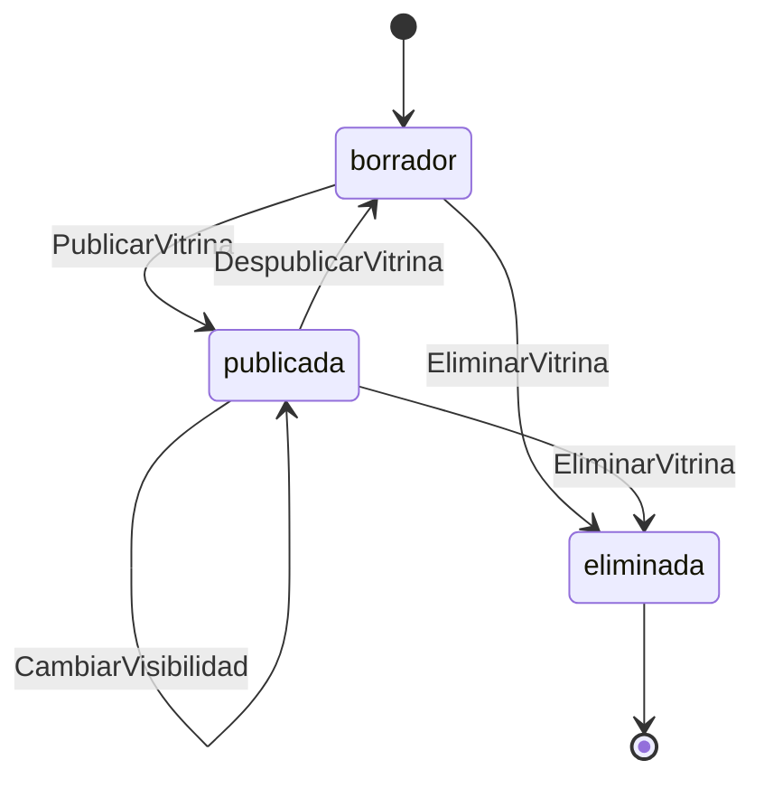

# Requisitos — Lego Virtual Museum

**Basado en:** PRD-lite v0.3 §6 Alcance v1 · **Etapa:** MVP · **Exposición:** X2
**Fecha:** 2026-07-30 · **Versión:** 0.1

> Producido por `/expand`. Los `R-nn` de este documento son los **definitivos**: `/specify` los proyecta a la spec sin renumerar. Un `R-nn` sin origen no se emite (constitution A.2).

> **Nota de contexto (retroactiva):** este proyecto declaraba framework v1.1.0 en `project.md`, versión en la que `/expand` **no existía todavía** — por eso `docs/02-spec/spec.md` v0.3 tiene R-01 a R-16 escritos directamente, sin pasar por esta etapa. Con el framework ya en v1.2.0, este documento se genera ahora, después de la spec, no antes — situación atípica que el proceso normal evita. Ver **AS-01** en la sección 7 sobre cómo se resolvió la numeración para no invalidar la spec, los ADR y el prototipo ya aprobados.

## 0. Lentes activadas

`docs/modelo.md` §3.4 — Techo 1: Etapa MVP activa las lentes de dominio; Exposición X2 activa las lentes de obligación. **Las 7 lentes están activas a nivel de proyecto.** El Techo 2 (disparador por capacidad) cierra algunas para capacidades concretas — ver tabla de cierres debajo.

| Lente | Eje que la activa | Estado | Razón si está cerrada |
|-------|-------------------|:---:|-----------------------|
| L1 Ciclo de vida | Etapa MVP | activa | — |
| L2 Permisos rol × estado | Exposición X2 | activa | — |
| L3 Validaciones y límites | Etapa MVP | activa | — |
| L4 Modos de fallo | Etapa MVP | activa | — |
| L5 Fronteras y vacío | Etapa MVP | activa | — |
| L6 Concurrencia | Exposición X2 | activa | — |
| L7 Auditoría y mitad negativa | Exposición X2 | activa | — |

**Cierres por disparador** (lente activa por eje que no aplica a una capacidad concreta):

| Capacidad | Lente | Razón del cierre |
|-----------|:---:|------------------|
| C1 (crear vitrina) | L6 | El recurso no es accesible ni conocido por nadie más que el dueño antes de publicarse (C3); ningún otro actor puede escribirlo en este punto del ciclo de vida. |
| C2 (subir fotos) | L6 | Mismo motivo que C1: solo el dueño escribe fotos de su propio set — no hay coautoría de contenido en v1. |
| C3 (publicar/visibilidad) | L5 | No acepta colección, número, fecha ni texto libre: es la selección de un enum cerrado de 3 valores, sin frontera de cardinalidad aplicable. |
| C6 (perfil resumen) | L1 | Es una proyección de solo lectura sobre agregados de Vitrina/Set ya cubiertos por C1/C3; no crea ni transiciona una entidad propia. |
| C6 (perfil resumen) | L3 | Vista de solo lectura sin formulario; el único input es un identificador de ruta, ya gobernado por el contrato de acceso (L2), no por validación de contenido. |
| C6 (perfil resumen) | L6 | Solo lectura: no hay escritura concurrente que gobernar. |
| C6 (perfil resumen) | L7 | No escribe ni borra datos de persona; la exposición de agregados públicos ya está gobernada por L2 y por PRIV-01/03 (spec §5b). |
| C7 (explorar) | L1 | Solo lectura: no crea ni transiciona ninguna entidad. |
| C7 (explorar) | L6 | Solo lectura: no hay escritura concurrente que gobernar. |
| C7 (explorar) | L7 | No escribe ni borra datos de persona. |

## 1. Dominio

Event Storming ligero sobre C1-C7 (todas *must* — PRD §6, incluida C7 promovida en el addendum v0.3/ADR-008).

**Eventos**
- BrickOtorgado · InsigniaDesbloqueada · BountyCreado · BountyReclamado
- VitrinaCreada · SetAñadido · FotoSubida · MetadataEXIFGPSLimpiada
- VitrinaPublicada · VisibilidadCambiada · VitrinaDespublicada · VitrinaEliminada
- CuentaRegistrada · ConsentimientoOtorgado · ConsentimientoRetirado · BorradoDeCuentaSolicitado · CascadaDeBorradoEjecutada · CuentaPurgada
- ContenidoReportado · ReporteResuelto · ContenidoOcultadoPorModeracion
- EnlaceGenerado · EnlaceVisitado · VitrinaVisitada · BúsquedaEnExplorarRealizada

**Comandos** (imperativo · actor)
- OtorgarBrick (Visitante/Usuario) · ReclamarBounty (Dueño)
- CrearVitrina · AñadirSet · SubirFoto · PublicarVitrina · CambiarVisibilidad · DespublicarVitrina · EliminarVitrina — actor: **Dueño**
- RegistrarCuenta — actor: **Visitante** · OtorgarConsentimiento, RetirarConsentimiento, SolicitarBorradoDeCuenta — actor: **Usuario** (dueño de su propia cuenta)
- ReportarContenido — actor: **Usuario** (cualquiera autenticado que no sea el dueño del contenido)
- ResolverReporte — actor: **Admin**
- ExplorarVitrinas, VisitarVitrinaPorEnlace — actor: **Visitante** / Usuario / Tercero

**Políticas** (bajan a EARS plantilla 2 sin traducción)
- cuando FotoSubida entonces LimpiarMetadataEXIFGPS (automático, antes de persistir) → R-02
- cuando VitrinaPublicada(visibilidad=pública) entonces IndexarEnExplorar → R-08
- cuando CambiarVisibilidad(deja de ser pública) o DespublicarVitrina entonces RetirarDeExplorarYRevocarEnlace → R-36
- cuando ReporteResuelto(revisado_eliminado) entonces OcultarContenidoReportado → R-15
- cuando VitrinaEliminada entonces RevocarEnlacesYTokensDeInvitacion → R-11
- cuando SolicitarBorradoDeCuenta(+reautenticación) entonces IniciarCascadaDeBorrado → R-09
- cuando CascadaDeBorradoEjecutada + 30 días entonces PurgarBackups → R-09
- cuando EnlaceVisitado entonces IncrementarContadorDeVisitas → MED-03 (spec §10)

**Agregados**

| Agregado | Comandos que gobierna | ¿≥2 estados? | ¿≥2 actores escriben? |
|----------|----------------------|:---:|:---:|
| Vitrina (incluye Set y Foto, mismo límite de consistencia) | CrearVitrina, AñadirSet, SubirFoto, PublicarVitrina, CambiarVisibilidad, DespublicarVitrina, EliminarVitrina | Sí — borrador / publicada / eliminada (terminal), + atributo visibilidad mientras publicada | Sí — el dueño escribe directamente; Admin escribe indirectamente al ocultar contenido reportado |
| Cuenta | RegistrarCuenta, OtorgarConsentimiento, RetirarConsentimiento, SolicitarBorradoDeCuenta | Sí — activa / pendiente_purga / purgada (terminal) | No — solo el propio usuario |
| Reporte | ReportarContenido, ResolverReporte | Sí — pendiente / revisado_ok (terminal) / revisado_eliminado (terminal) | Sí — el reportante crea, el admin resuelve |

## 2. Ciclo de vida de las entidades [L1]

### 2.1 Vitrina

**Estados:** borrador · publicada · eliminada (terminal). Atributo `visibilidad` (pública / privada / privada_enlace) solo tiene efecto mientras `publicada`.

| Desde | Hacia | Disparador | Quién puede | Efecto sobre artefactos derivados | Req |
|-------|-------|-----------|-------------|-----------------------------------|-----|
| borrador | publicada | PublicarVitrina (elige visibilidad) | Dueño | Genera token de invitación si `privada_enlace`; se indexa en Explorar si es pública | R-34 |
| publicada | borrador | DespublicarVitrina | Dueño | Revoca de inmediato el índice de Explorar y el enlace/token existentes | R-35, R-36 |
| publicada (pública) | publicada (privada / privada_enlace) | CambiarVisibilidad | Dueño | Retira de Explorar de inmediato; el enlace público anterior deja de resolver contenido (AS-05) | R-36 |
| borrador / publicada | eliminada | EliminarVitrina | Dueño | Borra en cascada sets y fotos; revoca cualquier enlace o token emitido; se retira de Explorar y de cualquier caché de listado | R-11 |
| publicada (cualquier visibilidad) | publicada (oculta por moderación) | ResolverReporte(revisado_eliminado) sobre su contenido | Admin | Oculta el contenido reportado sin alterar el `estado` de publicación que ve el dueño; se retira de Explorar mientras esté oculto | R-15, R-41 |

**Transiciones prohibidas:** cualquier transición sobre una vitrina en estado `eliminada` (terminal) — R-37.

**Foto** es una entidad de estado único (persistida, inmutable tras la limpieza de metadata) que vive dentro del límite de consistencia de Vitrina: se declara y se cierra en esta línea, sin tabla propia.

### 2.2 Cuenta

**Estados:** activa · pendiente_purga · purgada (terminal).

| Desde | Hacia | Disparador | Quién puede | Efecto sobre artefactos derivados | Req |
|-------|-------|-----------|-------------|-----------------------------------|-----|
| activa | pendiente_purga | SolicitarBorradoDeCuenta (+ reautenticación) | Propio usuario | Cascada de borrado sobre vitrinas/sets/fotos/reportes propios; los enlaces ya compartidos de sus vitrinas dejan de resolver | R-09, R-46 |
| pendiente_purga | purgada | PurgarBackups (automático, ≤30 días) | Sistema | Purga definitiva de copias de seguridad | R-09 |

**Transiciones prohibidas:** `purgada` → cualquier estado (terminal); `pendiente_purga` → `activa` — no existe ventana de cancelación (**AS-07**) — R-43.

### 2.3 Reporte

**Estados:** pendiente · revisado_ok (terminal) · revisado_eliminado (terminal).

| Desde | Hacia | Disparador | Quién puede | Efecto sobre artefactos derivados | Req |
|-------|-------|-----------|-------------|-----------------------------------|-----|
| pendiente | revisado_ok | ResolverReporte | Admin | Ninguno — el contenido permanece visible | R-06, R-15 |
| pendiente | revisado_eliminado | ResolverReporte | Admin | Oculta el contenido reportado (vitrina o set) | R-06, R-15, R-41 |

**Transiciones prohibidas:** `revisado_ok` o `revisado_eliminado` → `pendiente` (sin reversión); `revisado_ok` ↔ `revisado_eliminado` (un reporte resuelto no cambia de resolución) — R-51.

## 3. Permisos rol × estado [L2 · X2+]

**Roles del proyecto** (salen de los actores de §1): **Visitante** (sin cuenta) · **Usuario** (autenticado, no dueño del recurso) · **Dueño** (usuario autenticado, propietario) · **Admin** (moderación, el propio autor en v1).

Notación: `L` leer · `E` editar · `T` transicionar · `B` borrar · `—` denegado (cada `—` no evidente cita su `R-nn`).

### 3.1 Vitrina (+ Set, Foto)

| Rol \ Estado | borrador | publicada (pública) | publicada (privada) | publicada (privada_enlace) |
|---|---|---|---|---|
| Visitante | — (R-17, R-71) | L | — (R-71) | L solo con token (R-72) |
| Usuario (no dueño) | — (R-71) | L | — (R-71) | L solo con token (R-72) |
| Dueño | L, E, T, B | L, E, T, B | L, E, T, B | L, E, T, B |
| Admin | — (no interactúa: sin reportes posibles sobre contenido no publicado) | L, T (ocultar vía reporte) | L, T (ocultar) | L, T (ocultar) |

### 3.2 Cuenta

| Rol \ Estado | activa | pendiente_purga | purgada |
|---|---|---|---|
| Visitante | E (solo registrar la propia, nueva) | — | — |
| Propio usuario | L, E, T (→ pendiente_purga) | L (ver que está pendiente) | — (no existe) |
| Otro usuario | — (R-44) | — (R-44) | — |
| Admin | — N/A: sin panel de gestión de usuarios en v1 (spec §12, exclusión 10) | — | — |

### 3.3 Reporte

| Rol \ Estado | pendiente | revisado_ok | revisado_eliminado |
|---|---|---|---|
| Reportante | E (solo crear) | — (**AS-06**: sin vista de seguimiento propia en v1) | — (AS-06) |
| Reportado | — (R-57, RC-03) | — | — |
| Admin | L, T | L | L |
| Otro usuario/Visitante | — (R-52) | — (R-52) | — (R-52) |

**Denegación por defecto [X3]:** no aplica — el proyecto es X2, no X3 (`docs/modelo.md` §3.4).

## 4. Requisitos EARS

Plantillas: **1** ubicua · **2** evento · **3** estado · **4** opcional · **5** no deseada · **6** compleja.

| ID | Pl. | Requisito | Capacidad | Origen | Lente | Clasif. |
|----|:---:|-----------|:---:|--------|:---:|:---:|
| R-01 | 2 | Cuando un usuario autenticado envíe el formulario de creación de vitrina con al menos el nombre del set, el sistema deberá crear la vitrina en estado "borrador" con el set asociado. | C1 | PRD §6 C1 | — | v1 |
| R-02 | 2 | Cuando se suba una imagen a un set, el sistema deberá eliminar sus metadatos EXIF/GPS antes de persistirla; la original con metadata nunca se almacena. | C2 | RC-01; PRD §6 C2; ADR-005 | L7 | v1 |
| R-03 | 4 | Donde el usuario publique una vitrina, el sistema deberá permitir elegir entre visibilidad pública, privada sin acceso, o privada con enlace de invitación. | C3 | PRD §6 C3 | L1 | v1 |
| R-04 | 2 | Cuando un visitante se registre, el sistema deberá crear la cuenta con solo email y contraseña, sin exigir foto de perfil personal ni datos de contacto adicionales. | C4 | RC-01; PRD §6 C4 | L3 | v1 |
| R-05 | 5 | Si una solicitud intenta iniciar o exponer un canal de mensajería o contacto directo 1:1 entre dos usuarios, entonces el sistema deberá rechazarla — no existe tal capacidad en ningún flujo. | C4 | RC-02 | L2 | v1 |
| R-06 | 2 | Cuando un usuario reporte contenido, el sistema deberá registrarlo en la cola de revisión solo-admin sin exponer la identidad del reportante al reportado ni correlacionar IP/sesión hacia el reportado. | C5 | RC-03; ADR-004; PRD §6 C5 | L7 | v1 |
| R-07 | 1 | El sistema deberá mostrar en el perfil del propio usuario el número de sets, la temática predominante y datos agregados básicos. | C6 | PRD §6 C6 | — | v1 |
| R-08 | 6 | Mientras una vitrina tenga visibilidad pública y esté publicada, cuando un visitante consulte Explorar con un filtro de temática, un orden o una búsqueda de texto, el sistema deberá devolver solo esas vitrinas, combinando los tres criterios. | C7 | PRD §6 C7 (must); A2 | L3 | v1 |
| R-09 | 3 | Mientras existan datos personales de un usuario, el sistema deberá permitir su borrado completo (cascada + purga de backups ≤30 días) a solicitud propia reautenticada. | C4 | RC-04 | L1, L7 | v1 |
| R-10 | 2 | Cuando el usuario autenticado acceda a su panel propio, el sistema deberá mostrar sus agregados (vitrinas por estado, sets, piezas, visitas, temática predominante) y accesos directos a crear o editar. | C6 | PRD §6 C6 | — | v1 |
| R-11 | 1 | El sistema deberá permitir al dueño listar, editar, cambiar visibilidad, despublicar, copiar el enlace y eliminar sus propias vitrinas. | C4 | PRD §6 C4 | L1 | v1 |
| R-12 | 2 | Cuando se abra un set dentro de una vitrina accesible, el sistema deberá mostrar su ficha completa y su galería de fotos ordenadas, con navegación al set anterior/siguiente de la misma vitrina. | C1, C2 | PRD §6 C1, C2 | L5 | v1 |
| R-13 | 2 | Cuando se acceda al perfil público de un coleccionista con al menos una vitrina pública, el sistema deberá mostrar avatar genérico, agregados públicos y sus vitrinas públicas, sin ningún dato de contacto. | C6 | RC-01, RC-02; PRD §6 C6 | L7 | v1 |
| R-14 | 1 | El sistema deberá permitir al usuario cambiar su avatar genérico, gestionar su consentimiento y solicitar el borrado de su cuenta con reautenticación. | C4 | RC-04; PRD §6 C4 | — | v1 |
| R-15 | 2 | Cuando el admin resuelva un reporte como "revisado_eliminado", el sistema deberá ocultar el contenido reportado sin revelar en ningún momento la identidad del reportante al reportado. | C5 | RC-03 | L1, L7 | v1 |
| R-16 | 3 | Mientras una superficie nueva (R-08 a R-15) esté cargando, vacía, en error o sin resultados (Explorar con filtros aplicados), el sistema deberá mostrar el estado correspondiente con una acción sugerida cuando aplique. | C1-C7 | checklist uxui §3 | L5 | v1 |
| R-17 | 5 | Si un visitante sin sesión intenta crear una vitrina, entonces el sistema deberá rechazar la solicitud con 401. | C1 | RC-01, C4 | L2 | v1 |
| R-18 | 5 | Si el formulario de creación de vitrina se envía sin el nombre del set, entonces el sistema deberá rechazarlo con un error 422 indicando el campo obligatorio faltante. | C1 | PRD §6 C1 | L3 | v1 |
| R-19 | 5 | Si el nombre del set excede 200 caracteres (**AS-08**), entonces el sistema deberá rechazar el campo indicando el límite permitido. | C1 | PRD §6 C1 | L3 | v1 |
| R-20 | 5 | Si la fecha de lanzamiento enviada no tiene un formato de fecha válido, entonces el sistema deberá rechazar el campo sin persistir la vitrina. | C1 | PRD §6 C1 | L3 | v1 |
| R-21 | 5 | Si la creación del set asociado falla después de haberse creado la vitrina, entonces el sistema deberá revertir la creación completa de forma atómica, sin dejar una vitrina huérfana sin sets. | C1 | PRD §6 C1 | L4 | v1 |
| R-22 | 6 | Mientras una solicitud de creación de vitrina esté en curso, cuando se reciba un reintento de la misma solicitud tras un fallo parcial, el sistema deberá comportarse de forma idempotente y no duplicar la vitrina. | C1 | PRD §6 C1 | L4 | v2 |
| R-23 | 5 | Si el número de piezas enviado es negativo, entonces el sistema deberá rechazar el campo. | C1 | PRD §6 C1 | L5 | v1 |
| R-24 | 5 | Si se solicita crear una vitrina sin ningún set, entonces el sistema deberá rechazarla (**AS-02**). | C1 | PRD §6 C1 | L5 | v1 |
| R-25 | 1 | El sistema deberá registrar en auditoría la creación de cada vitrina (actor, momento, id de vitrina) sin registrar el contenido de sus campos de texto libre. | C1 | X2, L7 | L7 | v1 |
| R-26 | 5 | Si un usuario que no es dueño del set intenta subirle una foto, entonces el sistema deberá rechazar la solicitud con 403. | C2 | RC-01, C4 | L2 | v1 |
| R-27 | 5 | Si el archivo subido no es jpeg/png/webp verificado por su contenido real, entonces el sistema deberá rechazarlo con 415. | C2 | PRD §6 C2 | L3 | v1 |
| R-28 | 5 | Si el archivo subido supera 10MB, entonces el sistema deberá rechazarlo con 413 antes de iniciar la limpieza de metadata. | C2 | PRD §6 C2 | L3 | v1 |
| R-29 | 5 | Si la limpieza de metadata EXIF/GPS falla por cualquier motivo, entonces el sistema deberá rechazar la subida y no persistir ninguna versión del archivo, ni con ni sin metadata. | C2 | RC-01 | L4 | v1 |
| R-30 | 6 | Mientras una subida esté en curso hacia el almacenamiento, cuando la conexión se interrumpa a medias, el sistema deberá dejar la operación en un estado reconciliable, sin archivo parcial persistido ni referenciado en la base de datos. | C2 | PRD §6 C2 | L4 | v1 |
| R-31 | 5 | Si se intenta subir una foto a un set que ya alcanzó el máximo de 20 fotos (**AS-09**), entonces el sistema deberá rechazar la subida indicando el límite. | C2 | PRD §6 C2 | L5 | v1 |
| R-32 | 1 | El sistema deberá registrar en auditoría cada subida de foto (actor, set, momento) sin registrar el contenido de la imagen ni sus metadatos originales. | C2 | X2, L7 | L7 | v1 |
| R-33 | 5 | Si una imagen con metadata EXIF/GPS es interceptada antes de su limpieza, entonces el sistema deberá garantizar que dicha metadata nunca llega a ningún log ni sistema de auditoría (caso de referencia, constitution A.2). | C2 | RC-01 | L7 | v1 |
| R-34 | 2 | Cuando el dueño publique una vitrina, el sistema deberá exigir que tenga al menos un set con nombre válido antes de permitir la transición a "publicada". | C3 | PRD §6 C3 | L1 | v1 |
| R-35 | 2 | Cuando el dueño despublique una vitrina, el sistema deberá tratarlo como una transición válida que retorna la vitrina al estado "borrador" conservando todo su contenido. | C3 | PRD §6 C4 | L1 | v1 |
| R-36 | 2 | Cuando una vitrina publicada se despublique o su visibilidad deje de ser pública, el sistema deberá revocar de inmediato su indexación en Explorar y su enlace público existente deberá dejar de resolver contenido. | C3 | A2 (**AS-05**) | L1 | v1 |
| R-37 | 5 | Si se solicita cualquier transición de estado o cambio sobre una vitrina ya eliminada, entonces el sistema deberá rechazarla con 404. | C3 | PRD §6 C4 | L1 | v1 |
| R-38 | 5 | Si un usuario que no es dueño intenta publicar o cambiar la visibilidad de una vitrina ajena, entonces el sistema deberá rechazarlo con 403. | C3 | RC-01 | L2 | v1 |
| R-39 | 5 | Si el valor de visibilidad enviado no es uno de los 3 valores permitidos, entonces el sistema deberá rechazar la solicitud con un error de validación. | C3 | PRD §6 C3 | L3 | v1 |
| R-40 | 5 | Si la generación del token de invitación falla al publicar en modo "privada_enlace", entonces la vitrina deberá permanecer en su estado previo, sin quedar publicada con un enlace roto. | C3 | PRD §6 C3 | L4 | v1 |
| R-41 | 6 | Mientras un admin esté ocultando contenido de una vitrina por resolución de reporte, cuando el dueño intente simultáneamente cambiar su visibilidad, el sistema deberá aplicar ambos cambios de forma consistente y la ocultación por moderación deberá prevalecer. | C3 | RC-03 | L6 | v1 |
| R-42 | 1 | El sistema deberá registrar en auditoría cada cambio de visibilidad y de estado de una vitrina (actor, vitrina, valores anterior/nuevo, momento). | C3 | X2, L7 | L7 | v1 |
| R-43 | 5 | Si se solicita iniciar sesión o acceder a datos de una cuenta ya en estado "pendiente_purga", entonces el sistema deberá rechazar el acceso indicando que la cuenta está en proceso de eliminación. | C4 | RC-04 | L1 | v1 |
| R-44 | 5 | Si un usuario autenticado intenta acceder a la lista de "mis vitrinas" de otro usuario, entonces el sistema deberá rechazarlo con 401/403 según corresponda. | C4 | RC-01 | L2 | v1 |
| R-45 | 5 | Si el email o la contraseña de registro no cumplen el formato o longitud mínima exigidos, entonces el sistema deberá rechazar el registro con el error específico de campo. | C4 | PRD §6 C4 | L3 | v1 |
| R-46 | 6 | Mientras la cascada de borrado de cuenta esté en curso, cuando se reciba un reintento de la solicitud de borrado tras una interrupción parcial, el sistema deberá completarla de forma idempotente, sin duplicar operaciones ni dejar recursos huérfanos. | C4 | RC-04 | L4 | v1 |
| R-47 | 5 | Si la reautenticación exigida para borrar la cuenta falla, entonces el sistema deberá rechazar la solicitud de borrado sin iniciar ningún efecto sobre los datos. | C4 | RC-04 | L4 | v1 |
| R-48 | 5 | Si se solicita gestionar (editar, publicar, eliminar) una vitrina cuya cuenta propietaria ya está en "pendiente_purga", entonces el sistema deberá rechazar la operación. | C4 | RC-04 | L6 | v1 |
| R-49 | 5 | Si se registra un consentimiento sin versión y fecha asociadas, entonces el sistema deberá rechazar el registro de la cuenta. | C4 | RC-04 | L7 | v1 |
| R-50 | 5 | Si un registro de log intenta incluir el email o la contraseña de un usuario, entonces el sistema deberá impedirlo. | C4 | RC-04, X2 | L7 | v1 |
| R-51 | 5 | Si se intenta transicionar un reporte ya resuelto ("revisado_ok" o "revisado_eliminado") de vuelta a "pendiente" o entre sí, entonces el sistema deberá rechazarlo — no existe transición de reversión. | C5 | RC-03 | L1 | v1 |
| R-52 | 5 | Si un usuario no-admin intenta acceder a la cola de reportes o resolver un reporte, entonces el sistema deberá rechazarlo con 404, sin revelar que la ruta existe. | C5 | RC-03 | L2 | v1 |
| R-53 | 5 | Si el reporte se envía sin motivo o con un motivo vacío, entonces el sistema deberá rechazarlo con un error de validación. | C5 | PRD §6 C5 | L3 | v1 |
| R-54 | 5 | Si el contenido referenciado por un reporte ya no existe al momento de crearlo, entonces el sistema deberá rechazar el reporte con 404. | C5 | PRD §6 C5 | L4 | v1 |
| R-55 | 5 | Si un mismo usuario supera el límite de 5 reportes por hora, entonces el sistema deberá rechazar los reportes adicionales con 429. | C5 | ADR-004 | L5 | v1 |
| R-56 | 6 | Mientras dos reportes distintos sobre el mismo contenido estén pendientes, cuando el admin resuelva uno de ellos como "revisado_eliminado", el sistema deberá marcar automáticamente el resto de reportes pendientes sobre ese mismo contenido como resueltos, sin dejarlos huérfanos en la cola. | C5 | RC-03 | L6 | v2 |
| R-57 | 5 | Si el reportado solicita, por cualquier vía, conocer la identidad de quien lo reportó, entonces el sistema deberá negar esa información en cualquier respuesta o vista distinta del rol admin. | C5 | RC-03 | L7 | v1 |
| R-58 | 5 | Si un reporte se registra en auditoría o logs, entonces el sistema deberá excluir de dicho registro la IP y el historial de sesión del reportante. | C5 | RC-03 | L7 | v1 |
| R-59 | 5 | Si un usuario autenticado intenta acceder al panel propio de otro usuario, entonces el sistema deberá rechazarlo con 401/403. | C6 | RC-01 | L2 | v1 |
| R-60 | 5 | Si se consulta el perfil público de un usuario sin ninguna vitrina pública, entonces el sistema deberá responder 404, salvo que quien consulta sea el propio dueño autenticado. | C6 | PRD §6 C6 | L2 | v1 |
| R-61 | 5 | Si falla la agregación de una de las fuentes del panel propio (vitrinas, sets o visitas), entonces el sistema deberá responder con un error explícito, nunca con agregados parciales sin indicarlo. | C6 | X2, L4 | L4 | v1 |
| R-62 | 5 | Si se solicita el perfil público de un coleccionista, entonces el sistema deberá excluir de la respuesta el email, la fecha de registro y cualquier dato de contacto. | C6 | RC-01, RC-02 | L7 | v1 |
| R-63 | 3 | Mientras un visitante no tenga sesión activa, el sistema deberá restringir el acceso al panel propio y mostrar en su lugar el perfil público cuando corresponda. | C6 | RC-01 | L2 | v1 |
| R-64 | 5 | Si el texto de búsqueda en Explorar excede 100 caracteres (**AS-10**) o contiene caracteres no soportados, entonces el sistema deberá sanearlo o rechazarlo, sin producir un error 500. | C7 | A2 | L3 | v1 |
| R-65 | 5 | Si el parámetro de orden enviado a Explorar no es uno de los valores permitidos, entonces el sistema deberá usar "recientes" por defecto (**AS-03**) en vez de fallar. | C7 | A2 | L3 | v1 |
| R-66 | 5 | Si la búsqueda de texto de Explorar falla, entonces el sistema deberá degradar a listar sin el filtro de texto en vez de devolver un error total (**AS-04**). | C7 | A2 | L4 | v1 |
| R-67 | 5 | Si se solicita una página de Explorar fuera de rango, entonces el sistema deberá devolver una lista vacía en vez de un error. | C7 | PRD §6 C7 | L5 | v1 |
| R-68 | 1 | El sistema deberá paginar los resultados de Explorar en bloques de 24 vitrinas. | C7 | PRD §6 C7 | L5 | v1 |
| R-69 | 5 | Si una vitrina no pública o no publicada aparece en los resultados de Explorar por cualquier motivo, entonces el sistema deberá tratarlo como un defecto bloqueante — nunca debe ocurrir. | C7 | RC-01, A2 | L2 | v1 |
| R-70 | 6 | Mientras se pagina un resultado grande de Explorar, cuando una vitrina cambie de pública a privada entre una página y la siguiente, el sistema deberá excluirla de la página siguiente sin duplicar ni omitir otras vitrinas por el desplazamiento del cursor. | C7 | A2 | L6 | v2 |
| R-71 | 5 | Si alguien que no es el dueño intenta acceder a una vitrina en estado "borrador" o con visibilidad "privada" (sin acceso), entonces el sistema deberá denegarlo con 404, el mismo código que "no existe". | C1, C3 | RC-01 | L2 | v1 |
| R-72 | 5 | Si se accede a una vitrina "privada_enlace" sin el token de invitación correcto, entonces el sistema deberá denegarlo con 404, el mismo código que "no existe". | C3 | RC-01 | L2 | v1 |

**Regla de densidad — verificación por capacidad** (todas *must*, todas de complejidad media: su entidad central tiene ≥2 estados, o toca ≥2 recursos, o involucra ≥2 roles):

| Capacidad | Total requisitos | Plantilla 5 | Plantilla 3/6 | ¿Cumple ≥8, ≥2 t5, ≥1 t3/6? |
|---|:---:|:---:|:---:|:---:|
| C1 | 11 (R-01, R-12, R-17 a R-25) | 7 | 1 (R-22) | Sí |
| C2 | 10 (R-02, R-12, R-26 a R-33) | 6 | 1 (R-30) | Sí |
| C3 | 10 (R-03, R-34 a R-42, R-72) | 6 | 1 (R-41) | Sí |
| C4 | 15 (R-04, R-05, R-09, R-11, R-14, R-43 a R-50, R-71) | 8 | 1 (R-46) | Sí |
| C5 | 10 (R-06, R-15, R-51 a R-58) | 7 | 1 (R-56) | Sí |
| C6 | 8 (R-07, R-10, R-13, R-59 a R-63) | 3 | 1 (R-63) | Sí |
| C7 | 10 (R-08, R-64 a R-70) | 6 | 2 (R-08, R-70) | Sí |

Ratio total: 72 requisitos / 7 capacidades ≈ **10,3:1** (supera el 1:8 esperado para complejidad media).

| R-73 | 2 | Cuando un visitante o usuario pulse "Dar Brick" en un set, el sistema deberá incrementar el contador de bricks del set y registrar la interacción para evitar votos duplicados por IP/sesión. | C8 | Addendum | L3, L6 | v1 |
| R-74 | 5 | Si el sistema detecta que la misma IP o usuario ya otorgó un brick a ese set, entonces deberá ignorar la solicitud de forma idempotente. | C8 | Addendum | L3 | v1 |
| R-75 | 2 | Cuando un usuario publique un set que coincide con un Bounty activo, el sistema deberá marcar el Bounty como reclamado y otorgar la recompensa en bricks al usuario. | C10 | Addendum | L1 | v1 |
| R-76 | 2 | Cuando se actualicen los agregados del usuario, el sistema deberá calcular y asignar Insignias automáticamente según los umbrales predefinidos (ej. sets, piezas). | C9 | Addendum | L1 | v1 |
| R-77 | 1 | El sistema deberá exponer una ruta para recuperar las Exposiciones Temporales activas y los Bounties pendientes para la portada. | C10, C12 | Addendum | L5 | v1 |

## 5. Corte

| | v1 | v2 | Descartado |
|---|:---:|:---:|:---:|
| Requisitos | 69 | 3 | 0 |

**Fuera de v1, con razón:**

| ID | Destino | Razón |
|----|:---:|-------|
| R-22 | v2 | Deduplicación idempotente ante reintento de red en la creación de vitrina: mitiga un duplicado de datos, no una pérdida ni una brecha de permisos/legal. El cliente puede mitigar deshabilitando el botón tras el envío; se revisita si aparecen duplicados reales en producción. |
| R-56 | v2 | Auto-resolución de reportes duplicados sobre el mismo contenido: nicety de flujo de trabajo del admin (rol = el propio autor en v1), no afecta anonimato ni datos; el admin puede resolverlos manualmente sin coste real dado el volumen esperado en MVP. |
| R-70 | v2 | Inconsistencia de paginación en Explorar ante un cambio de visibilidad entre páginas: carrera de baja probabilidad con efecto cosmético (una vitrina omitida o repetida una página), no pérdida de datos ni brecha de permisos — R-69 (nunca debe aparecer una vitrina no pública) ya cubre el riesgo real de fuga. |

Todos los demás requisitos entran en v1 por la regla de `docs/modelo.md` §3.4: sirven a una capacidad *must* (paso 2), o su ausencia produce pérdida de datos, brecha de permisos o incumplimiento legal (paso 1, no negociable) — en particular todo lo de L2 (permisos), L7 (auditoría/RC-04 GDPR) y los modos de fallo que dejarían recursos huérfanos (R-21, R-29, R-30, R-40, R-46, R-47).

**Encaje en presupuesto:** el presupuesto de la etapa MVP es ≤4 semanas (`project.md`), ya bajo revisión en `/plan` por el propio ADR-008 tras ampliar la superficie de 5 a 12 pantallas. La mayoría de los 56 requisitos nuevos de este documento (R-17 a R-72, menos los 3 diferidos a v2) **no añaden pantallas ni endpoints nuevos**: son el detalle de validación, denegación de permisos, manejo de fallos y auditoría de los mismos 16 endpoints/pantallas que la spec v0.3 ya presupuestaba — es decir, hacen explícito lo que un buen `/plan` habría tenido que decidir de todas formas al implementar R-01 a R-16, no trabajo neto adicional de superficie. El único efecto real sobre el presupuesto es tiempo de implementación por endpoint (validaciones y códigos de error adicionales), estimado menor al recorte ya aplicado (3 requisitos a v2). Si `/plan` determina que aun así no cabe, la propuesta concreta es diferir también R-46/R-30 (idempotencia/reconciliación ante fallos parciales) a v2, aceptando el riesgo de recursos huérfanos poco frecuentes como deuda documentada, en vez de estirar el plazo del 2026-08-24 en silencio (constitution B.7).

## 6. Historias de usuario y criterios de aceptación

### HU-01 — Crear y catalogar una vitrina (C1)
**Como** coleccionista con cuenta, **quiero** crear una vitrina y añadir sets con datos básicos, **para** empezar a exponer mi colección sin fricción.

| # | Criterio (Given / When / Then) | Requisitos |
|---|--------------------------------|-----------|
| AC-01.1 | Dado que tengo sesión iniciada, cuando envío el formulario solo con el nombre de un set, entonces la vitrina se crea en estado "borrador". | R-01 |
| AC-01.2 | Dado el mismo formulario, cuando lo envío sin nombre de set, entonces recibo un error 422 señalando el campo. | R-18 |
| AC-01.3 | Dado que no tengo sesión, cuando intento crear una vitrina, entonces recibo 401. | R-17 |
| AC-01.4 | Dado que intento crear una vitrina sin ningún set, entonces la solicitud se rechaza. | R-24 |

### HU-02 — Subir fotos anónimas (C2)
**Como** dueño de un set, **quiero** subir fotos sin que revelen mi ubicación ni identidad, **para** exponer mi colección con seguridad real.

| # | Criterio (Given / When / Then) | Requisitos |
|---|--------------------------------|-----------|
| AC-02.1 | Dada una foto con GPS embebido, cuando la subo, entonces el archivo servido no contiene esa metadata. | R-02, R-33 |
| AC-02.2 | Dado un archivo que no es una imagen soportada, cuando lo subo, entonces recibo 415. | R-27 |
| AC-02.3 | Dado que la limpieza de metadata falla, cuando reintento, entonces ningún archivo (con o sin metadata) queda persistido. | R-29 |

### HU-03 — Publicar con el nivel de visibilidad que elijo (C3)
**Como** dueño de una vitrina, **quiero** elegir su nivel de visibilidad al publicar, **para** controlar exactamente quién puede verla.

| # | Criterio (Given / When / Then) | Requisitos |
|---|--------------------------------|-----------|
| AC-03.1 | Dada una vitrina en borrador con 1 set válido, cuando la publico como pública, entonces queda accesible por enlace sin registro de quien la visita. | R-34, R-03 |
| AC-03.2 | Dada una vitrina publicada, cuando la despublico, entonces desaparece de Explorar y su enlace deja de resolver de inmediato. | R-36 |
| AC-03.3 | Dado un enlace con visibilidad "privada_enlace", cuando alguien accede sin el token correcto, entonces recibe 404. | R-72 |

### HU-04 — Gestionar mi cuenta y mis vitrinas de forma anónima (C4)
**Como** coleccionista, **quiero** registrarme, gestionar mis vitrinas y poder borrar mi cuenta, sin exponer datos que no quiero dar, **para** mantener el control de mi anonimato.

| # | Criterio (Given / When / Then) | Requisitos |
|---|--------------------------------|-----------|
| AC-04.1 | Dado que me registro solo con email y contraseña, cuando completo el registro, entonces mi cuenta se crea con avatar genérico, sin más campos obligatorios. | R-04 |
| AC-04.2 | Dado que solicito borrar mi cuenta y reautentico, cuando se confirma, entonces todos mis datos se eliminan en cascada y se programa la purga de backups en ≤30 días. | R-09, R-46 |
| AC-04.3 | Dado que la reautenticación para borrar mi cuenta falla, cuando lo intento, entonces no se dispara ningún efecto de borrado. | R-47 |
| AC-04.4 | Dado que intento ver "mis vitrinas" de otro usuario, cuando hago la solicitud, entonces se rechaza. | R-44 |

### HU-05 — Reportar contenido sin exponerme (C5)
**Como** cualquier usuario autenticado, **quiero** poder reportar contenido inapropiado sin que mi identidad llegue al reportado, **para** contribuir a la moderación sin asumir riesgo personal.

| # | Criterio (Given / When / Then) | Requisitos |
|---|--------------------------------|-----------|
| AC-05.1 | Dado que reporto una vitrina con un motivo, cuando el admin resuelve el reporte como "revisado_eliminado", entonces el contenido se oculta y mi identidad nunca fue visible para el reportado. | R-06, R-15, R-57 |
| AC-05.2 | Dado que ya envié 5 reportes en la última hora, cuando intento enviar uno más, entonces recibo 429. | R-55 |
| AC-05.3 | Dado que no soy admin, cuando intento acceder a la cola de reportes, entonces recibo 404. | R-52 |

### HU-06 — Ver mi resumen y el de otros coleccionistas (C6)
**Como** coleccionista, **quiero** ver de un vistazo mis agregados y los de otros perfiles públicos, **para** entender mi colección y conectar con intereses afines sin contacto directo.

| # | Criterio (Given / When / Then) | Requisitos |
|---|--------------------------------|-----------|
| AC-06.1 | Dado que tengo 2 vitrinas y 7 sets, cuando entro a mi panel, entonces veo mis agregados propios completos. | R-10, R-07 |
| AC-06.2 | Dado el perfil público de otro coleccionista con vitrinas públicas, cuando lo visito, entonces no veo su email, fecha de registro ni ninguna vía de contacto. | R-13, R-62 |
| AC-06.3 | Dado que intento ver el panel propio de otro usuario, cuando hago la solicitud, entonces se rechaza. | R-59 |

### HU-07 — Descubrir vitrinas en Explorar (C7)
**Como** visitante o usuario, **quiero** filtrar, ordenar y buscar vitrinas públicas, **para** encontrar coleccionistas con intereses afines sin necesidad de registrarme.

| # | Criterio (Given / When / Then) | Requisitos |
|---|--------------------------------|-----------|
| AC-07.1 | Dado que filtro por temática "Star Wars", cuando consulto Explorar, entonces veo solo vitrinas públicas y publicadas de esa temática. | R-08 |
| AC-07.2 | Dado que ningún resultado coincide con mis filtros, cuando consulto Explorar, entonces veo el estado "sin resultados" con una sugerencia. | R-16 |
| AC-07.3 | Dado un parámetro de orden inválido, cuando consulto Explorar, entonces el sistema usa "recientes" por defecto en vez de fallar. | R-65 |

## 7. Asunciones y preguntas abiertas

**Asunciones de diseño** (constitution A.4-bis). Decisión elegida, no dato averiguado. Todo `R-nn` que dependa de una asunción la cita en su columna Origen.

| ID | Asunción | Razón | Riesgo si es falsa | Requisitos afectados | Estado |
|----|----------|-------|--------------------|---------------------|:---:|
| AS-01 | Reutilizar la numeración R-01 a R-16 tal como aparece en `spec.md` v0.3 (reescrita en EARS estricto, sin cambiar su contenido ni su origen), y numerar los requisitos nuevos surgidos de las lentes desde R-17. | Este `/expand` se ejecuta después de `/specify`, situación atípica: spec, ADR-008 y el prototipo de 12 pantallas ya citan R-01 a R-16 por ID. Renumerar desde cero invalidaría esas referencias cruzadas sin ganar nada a cambio. | Si el autor prefiere una numeración limpia sin relación con la spec existente, hay que remapear spec.md, ADR-008 y el prototipo vía `/amend` — coste de reconciliación, no de contenido. | Todos | propuesta |
| AS-02 | Una vitrina requiere al menos 1 set para poder crearse; no se permite una vitrina vacía en "borrador" sin ningún set. | El modelo de datos y R-01 ya asumen un formulario con un array de sets con al menos un elemento con nombre obligatorio; una vitrina sin sets no tiene nada que catalogar y no sirve al JTBD. | Si el autor quiere permitir guardar la intención de crear una vitrina antes de tener datos de ningún set, este requisito bloquea ese flujo — fácil de relajar en `/plan`. | R-24 | propuesta |
| AS-03 | Ante un valor de orden inválido en Explorar, el sistema usa el valor por defecto ("recientes") en vez de rechazar la solicitud con error. | Prioriza la disponibilidad de la superficie que sirve a A2 (la asunción más arriesgada) sobre el rigor estricto de validación de un parámetro opcional de bajo riesgo. | Si el autor prefiere fallar explícito para detectar bugs de cliente cuanto antes, este comportamiento los enmascararía silenciosamente. | R-65 | propuesta |
| AS-04 | Ante un fallo del motor de búsqueda de texto en Explorar, el sistema degrada a listar sin ese filtro en vez de fallar por completo. | Mantiene disponible la función principal de descubrimiento (crítica para A2) aunque falle un subsistema secundario. | El usuario podría no notar que su búsqueda de texto no se aplicó; mitigable con un aviso en la UI, a definir en `/plan`. | R-66 | propuesta |
| AS-05 | Al despublicar una vitrina o cambiar su visibilidad fuera de "pública", su enlace público existente deja de resolver contenido de inmediato, sin periodo de gracia. | Consistente con RC-01 (anonimato real): un enlace que sigue funcionando tras despublicar sería una fuga de control percibido por el dueño sobre su propia exposición. | Un usuario que quiera "pausar" temporalmente su vitrina sin invalidar el enlace compartido no tiene esa opción en v1; se puede añadir después sin cambio estructural. | R-36 | propuesta |
| AS-06 | El reportante no tiene visibilidad de sus propios reportes enviados en v1 (sin vista de seguimiento propia). | La spec v0.3 solo define `GET /api/admin/reportes` (solo-admin); no hay endpoint ni pantalla de "mis reportes" en el alcance actual. | Si el autor considera importante que el reportante sepa si su reporte fue atendido, es una capacidad nueva que no está en el alcance v1 del PRD y debería tramitarse como tal, no asumirse aquí. | Matriz §3.3 | propuesta |
| AS-07 | No existe ventana de cancelación tras solicitar el borrado de cuenta: la solicitud es irreversible desde el momento en que se confirma con reautenticación. | Simplifica el estado de "pendiente_purga" a uno solo de espera técnica (purga de backups), no de decisión revocable; RC-04 exige borrado real, no una cola de arrepentimiento. | Un usuario que se arrepiente tras confirmar no puede recuperar su cuenta; si el autor quiere una ventana de gracia (ej. 24-72h), es un cambio de comportamiento a introducir en `/plan`, no estructural. | R-43, §2.2 | propuesta |
| AS-08 | Longitud máxima del nombre de set: 200 caracteres. | Valor típico para campos de título en formularios web; sin evidencia de un límite específico del negocio, y de riesgo bajo asumirlo (constitution A.4-bis). | Si 200 resulta insuficiente o excesivo, es un cambio de validación trivial en `/plan`, sin impacto estructural. | R-19 | propuesta |
| AS-09 | Máximo de fotos por set: 20. | Equilibra mostrar una colección real con controlar el coste de Storage en el tier gratuito de Supabase previsto (`project.md`). | Si 20 resulta insuficiente para sets grandes (ej. dioramas con muchas piezas fotografiadas), se ajusta en `/plan` sin impacto estructural. | R-31 | propuesta |
| AS-10 | Longitud máxima del texto de búsqueda en Explorar: 100 caracteres. | Suficiente para búsquedas reales de nombre/título; evita payloads abusivos sobre un endpoint público sin sesión, sin bloquear casos de uso reales. | Riesgo bajo; ajustable en `/plan` si aparecen búsquedas legítimas más largas. | R-64 | propuesta |

**Huecos de dato** (constitution A.1). Aquí no se asume nada: se marca y se pregunta o se averigua.

- Ninguno abierto en este documento: los huecos de dato detectados durante la aplicación de lentes (longitudes máximas, límite de fotos) se resolvieron como decisiones de diseño de bajo riesgo (AS-08 a AS-10, constitution A.4-bis), no como datos que solo se puedan obtener preguntando o midiendo. Los `[PENDIENTE]` de obligación legal y de infraestructura (retención exacta de IP en rate limiting, región de proveedores, SLA de derechos GDPR) ya están marcados en `spec.md` §5/§5b y no se repiten aquí.

**Preguntas al usuario:** ninguna. El cupo de `/expand` es 2 (constitution B.6-bis), pero no queda ningún hueco que solo se resuelva preguntando: los huecos de dato de bajo riesgo se resolvieron como asunciones (AS-08 a AS-10) y el resto ya estaba resuelto en artefactos existentes (spec.md, ADR-004, ADR-008). Cupo acumulado de `/expand` a registrar en `project.md`: **0/2 consumidas**.

## Historial
| Versión | Fecha | Cambio | ADR |
|:---:|:---:|--------|-----|
| 0.1 | 2026-07-30 | Versión inicial, producida retroactivamente después de `spec.md` v0.3 (ver AS-01), tras actualizar el framework de v1.1.0 (donde `/expand` no existía) a v1.2.0. Reescribe R-01 a R-16 en EARS estricto preservando su contenido y origen; añade R-17 a R-72 mediante las 7 lentes de `docs/modelo.md` §3.4 sobre las 7 capacidades *must* del PRD-lite v0.3. | — |
