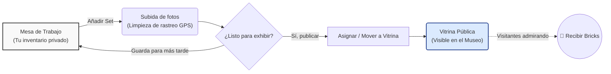
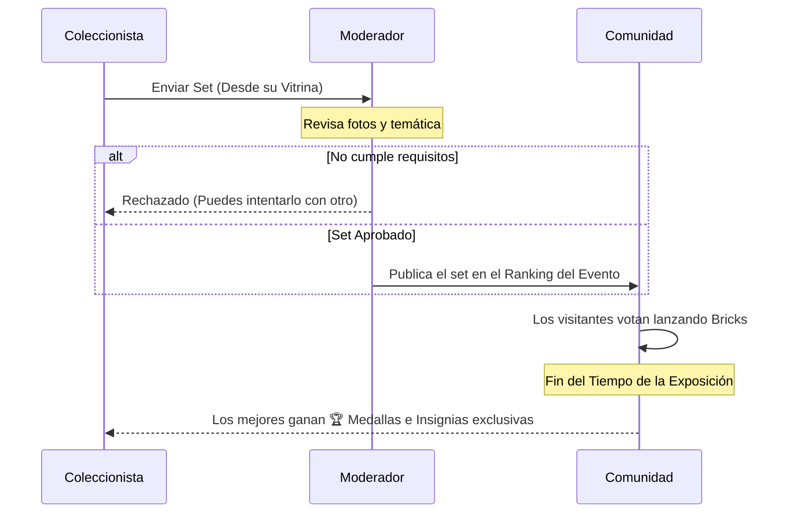
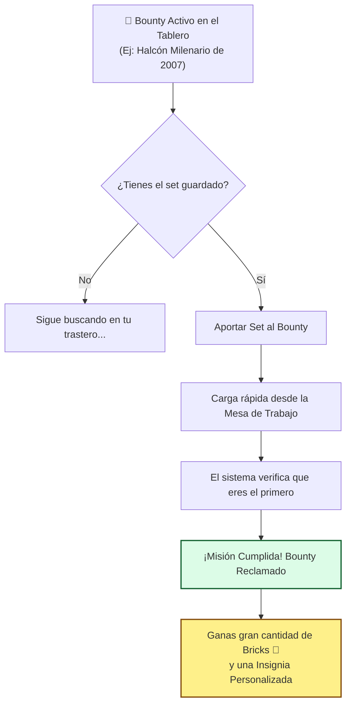
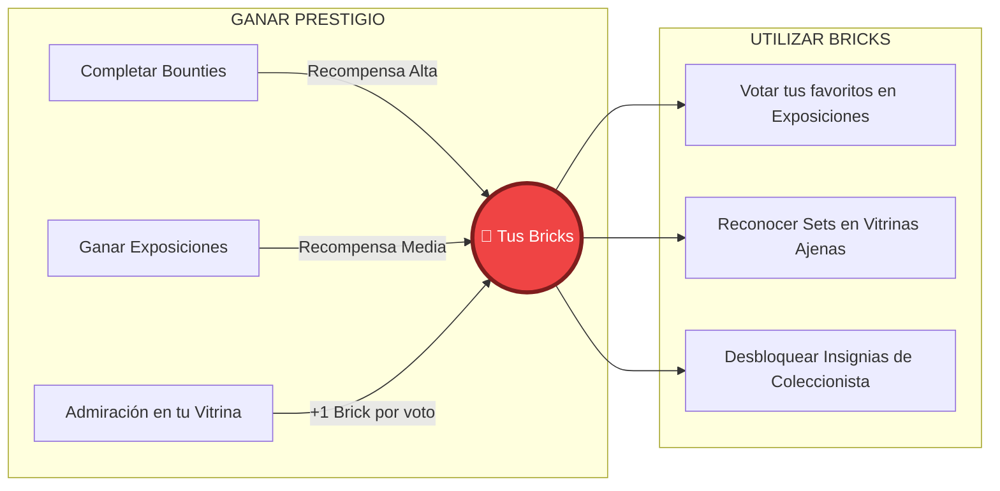

# Guía de Inicio: Cómo Funciona el Museo Virtual LEGO®

Bienvenido al refugio definitivo para coleccionistas. Hemos diseñado esta plataforma para que puedas organizar, exhibir y presumir de tu colección de forma 100% segura y privada, sin los riesgos que suponen las redes sociales tradicionales.

En esta guía te explicaremos de forma sencilla y visual cómo moverte por el museo, cómo participar en eventos exclusivos y cómo funciona nuestro ecosistema.

---

## 1. Tu Colección: De la Mesa de Trabajo a la Vitrina

El corazón de la plataforma es tu espacio personal. Imagina que tienes una habitación secreta donde guardas tus sets (Mesa de Trabajo), y un elegante mostrador de cristal blindado donde decides qué quieres que vea el mundo (Tus Vitrinas).

1. **La Mesa de Trabajo**: Es tu inventario privado. Aquí añades tus sets, subes fotos y gestionas tu colección lejos de miradas indiscretas. Al subir fotografías, nuestro sistema elimina automáticamente la ubicación (GPS) y los datos internos de la cámara para proteger tu privacidad.
2. **Las Vitrinas**: Son tus expositores públicos. Tú decides qué sets de tu Mesa de Trabajo están listos para ser movidos a cada Vitrina. Puedes crear tantas vitrinas como quieras para categorizar tu colección.
3. **Exploración**: Cualquier visitante puede pasear virtualmente por las Vitrinas públicas y dejar un reconocimiento en forma de *Bricks* a los sets que más le impresionen.

---

## 2. Exposiciones Temporales

Regularmente organizamos **Exposiciones**, eventos temáticos donde los coleccionistas pueden competir o simplemente mostrar sus mejores piezas junto a las de otros (por ejemplo: "Especial UCS Star Wars" o "Dioramas de Invierno"). 

Estas exposiciones están protegidas:
- Para poder ver los sets participantes y el ranking actual, necesitas **estar registrado e iniciar sesión**.
- No cualquier set puede participar; los moderadores revisan individualmente cada solicitud para asegurar que el set cumple con la temática del evento.

---

## 3. Bounties Comunitarios (Se Busca)

¿Tienes una joya rara en tu colección? Nuestro sistema de **Bounties (Recompensas)** es un tablero de anuncios donde la comunidad o los administradores publican misiones buscando sets difíciles de encontrar. 

Si eres el afortunado dueño de uno de estos sets buscados, puedes ser el primero en publicarlo para llevarte el premio.

---

## 4. La Economía de los "Bricks" 🧱

Los *Bricks* son nuestra moneda de prestigio y reconocimiento. Olvídate de los fríos "Me gusta" de otras redes. Aquí, un Brick representa el respeto de otro fanático de LEGO por tu dedicación, dinero y horas de montaje.

**¿Cómo funciona el ciclo del Brick?**

---

### 🛡️ Privacidad por Diseño
Recuerda: en el Museo Virtual **no hay** chats privados, **no hay** fotos de perfil con tu rostro, **ni hay** obligación de usar tu nombre real. 

Este es un espacio diseñado para que **tus LEGO sean los verdaderos y únicos protagonistas**, garantizando tu tranquilidad y anonimato frente a las miradas no deseadas del mundo real.
