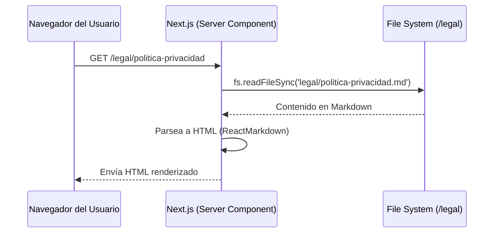

# Arquitectura Legal y de Cumplimiento Normativo (RGPD / DSA)

Este documento describe cómo se ha implementado el cumplimiento legal (Privacidad, Condiciones de Uso y Moderación) en **Lego Virtual Museum** a nivel técnico.

## 1. Estructura de Documentación Legal (`/legal`)

Hemos centralizado todos los textos legales en archivos Markdown dentro de la carpeta `/legal` en la raíz del proyecto. Esto permite a los propietarios del proyecto editar las condiciones de forma tan fácil como editar un `.md`, sin tocar código de React.

```text
LegoVirtualMuseum/
├── legal/
│   ├── data-map.md (Inventario interno de tratamientos y proveedores)
│   ├── politica-privacidad.md
│   ├── politica-cookies.md
│   ├── terminos-condiciones.md
│   ├── aviso-legal.md
│   └── politica-propiedad-intelectual.md
└── src/app/legal/[slug]/page.tsx (Componente de servidor que renderiza los MD)
```

### Flujo de Renderizado de Textos Legales



## 2. Ciclo de Vida de la Privacidad (Data Lifecycle)

El sistema está diseñado siguiendo el principio de **Privacidad desde el Diseño (Privacy by Design)**:

1. **Minimización de Datos:** No se recopilan nombres reales, solo emails (y se ocultan tras un *alias* aleatorio).
2. **Consentimiento Verificable:** Se almacena la versión de los términos aceptada y la fecha exacta en la base de datos (`usuarios_perfil.consentimiento_version`).
3. **Limpieza de Metadatos (EXIF):** Las imágenes subidas por el usuario pasan por un `<canvas>` en el navegador para ser convertidas a WebP/JPEG, lo que destruye automáticamente la geolocalización (GPS) y datos de cámara antes de subir a los servidores.
4. **Derecho al Olvido Automatizado:** Si un usuario elimina su cuenta, un API Route seguro invoca al Admin de Supabase para borrar el usuario central. Las reglas `ON DELETE CASCADE` de PostgreSQL se encargan de destruir sus vitrinas, sets, votos y fotos instantáneamente.

### Diagrama del Flujo de Datos

```mermaid
graph TD
    subgraph Cliente (Navegador)
        A[Formulario de Registro] -->|Check obligatorio + terms_v1| B(Supabase Auth Client)
        F[Subida de Fotos] -->|Limpieza EXIF Canvas| G(Blob WebP seguro)
    end
    
    subgraph Supabase (Frankfurt - UE)
        B -->|Inserta usuario| C[(auth.users)]
        C -->|Postgres Trigger| D[(public.usuarios_perfil)]
        D -. Guarda versión y fecha .-> D
        
        G -->|Upload| H[(Supabase Storage)]
    end
    
    subgraph Gestión de Derechos
        I[Botón Eliminar Cuenta] -->|POST /api/auth/delete-account| J[Next.js API (Service Role)]
        J -->|admin.deleteUser()| C
        C -->|ON DELETE CASCADE| D
        D -. Elimina en cascada .-> K[(vitrinas, sets, fotos)]
    end
```

## 3. Seguridad Perimetral

Para proteger los datos contra ataques comunes, la aplicación en Next.js inyecta en cada respuesta las siguientes cabeceras HTTP de seguridad configuradas en `next.config.ts`:

- `X-Frame-Options: DENY`: Evita ataques de *Clickjacking* impidiendo que la web sea cargada dentro de un iframe.
- `Strict-Transport-Security` (HSTS): Fuerza que todas las conexiones futuras se hagan por HTTPS cifrado durante al menos un año.
- `X-Content-Type-Options: nosniff`: Previene ataques de suplantación de tipos MIME.
- `Permissions-Policy`: Bloquea el acceso al micrófono, cámara o geolocalización del dispositivo, reduciendo la superficie de ataque.

## 4. Próximos Pasos de Gobierno (Fase 3)

- Mantener actualizado el documento `legal/data-map.md`.
- Si en el futuro se añade **analítica (ej. Google Analytics, Vercel Web Analytics, PostHog)**, será legalmente obligatorio añadir un Banner de Cookies que detenga su ejecución hasta que el usuario pulse "Aceptar". Actualmente, al usar solo cookies técnicas de sesión, esto no es necesario.
- Suscribir un Acuerdo de Encargado de Tratamiento (DPA) con el proveedor de hosting final.
